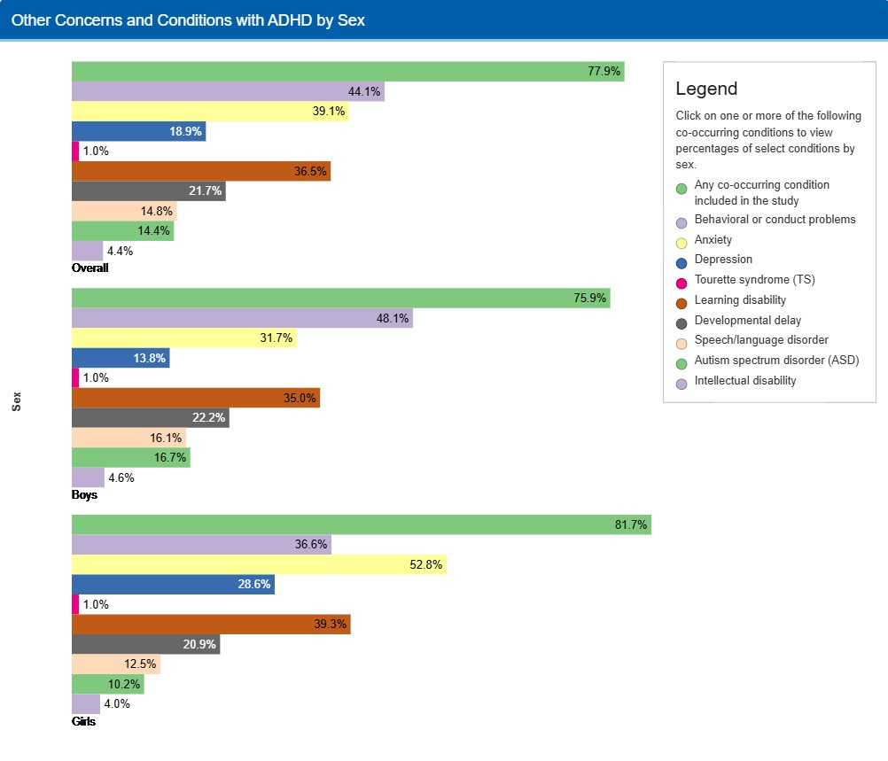
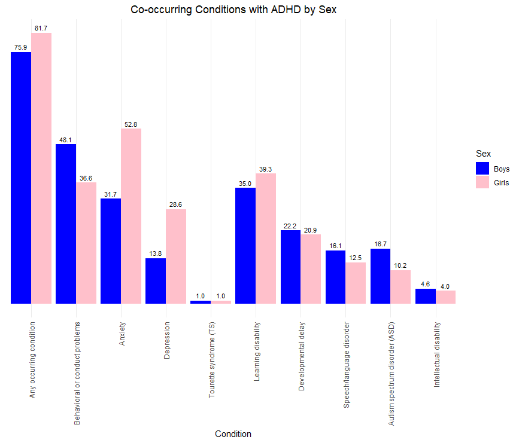

  
```{r setup, include=FALSE}
knitr::opts_chunk$set(echo = TRUE)
library(dplyr)
library(ggplot2)
library(tidyr)
```

## źródła

źródło wykresu: <https://www.cdc.gov/adhd/data/index.html>
data publikacji: 23.10.2024

## Wykres przed zmianą



## Komentarz przed zmianą
Na pierwszy rzut oka wykres(y) nie wydaje sie być taki zły, jednak uważam, że podjęta tutaj została próba uchwycenia zbyt dużej ilości danych na zbyt małej "przestrzeni". Zasadniczo nie podoba mi się, że mamy 3 wykresy - skoro rozpatrujemy symptomy osobno dla chłopców i dziewczynek (zasadnie, gdyż dla niektórych symptomów dysonans jest spory) - nie ma potrzeby robić dodatkowego wykresu, który prezentuje owe symptopmy bez podziału na płeć. Wykres taki nie wnosci ze sobą żadnej dodatkowej merytoryki, jedynie zmniejsza czytelność, odbiorca nie wie, na czym się skupić, gdyż jak wspomniałem uprzednio - jest zbyt dużo słupków poziomych. Sam wykres byłby znacznie przystępniejszy do analizy, gdyby słupki odpowiadające tym samym symptomom, tyle że u chłopców i dziewcząt, były koło siebie - znacznie ułatwiłoby to porównywanie danych ze sobą.


```{r zadanie 1, message=FALSE}

library(ggplot2)
library(dplyr)
library(tidyr)

adhd <- data.frame(
  Condition = c(
    "Any occurring condition", "Behavioral or conduct problems", "Anxiety", "Depression",
    "Tourette syndrome (TS)", "Learning disability",
    "Developmental delay", "Speech/language disorder",
    "Autism spectrum disorder (ASD)", "Intellectual disability"
  ),
  Boys = c(75.9, 48.1, 31.7, 13.8, 1.0, 35.0, 22.2, 16.1, 16.7, 4.6),
  Girls = c(81.7, 36.6, 52.8, 28.6, 1.0, 39.3, 20.9, 12.5, 10.2, 4.0)
)

adhd_long <- adhd %>%
  pivot_longer(cols = c("Boys", "Girls"), names_to = "Sex", values_to = "Percentage")

adhd_long$Condition <- factor(
  adhd_long$Condition,
  levels = c(
    "Any occurring condition", "Behavioral or conduct problems", "Anxiety", "Depression",
    "Tourette syndrome (TS)", "Learning disability",
    "Developmental delay", "Speech/language disorder",
    "Autism spectrum disorder (ASD)", "Intellectual disability"
  )
)


ggplot(adhd_long, aes(x = Condition, y = Percentage, fill = Sex)) +
  geom_bar(stat = "identity", position = position_dodge()) +
  geom_text(
    aes(label = sprintf("%.1f", Percentage)), 
    position = position_dodge(width = 0.9),   
    vjust = -0.5, 
    size = 3      
  ) +
  scale_fill_manual(values = c("Boys" = "blue", "Girls" = "pink")) +
  scale_y_continuous(breaks = NULL) +
  labs(
    title = "Co-occurring Conditions with ADHD by Sex",
    x = "Condition",
    y = NULL,
    fill = "Sex"
  ) +
  theme_minimal() +
  theme(
    axis.text.y = element_blank(),
    axis.ticks.y = element_blank(),
    axis.text.x = element_text(angle = 90, vjust = 0.5, hjust = 1),
    plot.title = element_text(hjust = 0.5)
  )


```

## Wykres po zmianie



## Komentarz po zmianie

Mamy 1 wykres - dzięki temu osiągnąłem lepszą czytelność i pozbyłem się niepotrzebnych danych. Slupki odpowiadające tym samym symptomom z podziałem na płeć są ustawione koło siebie, co ułatwia ich porównanie. Mamy tylko 2 kolory - zwyczajnie nie potrzeba więcej. Zdecydowałem się pozostawić kolumny "Any occuring condition", aby mieć wgląd, jak często z adhd w parze idą objawy innych przypadłości.