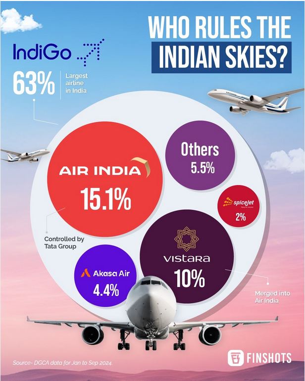

```{r setup, include=FALSE}
knitr::opts_chunk$set(echo = TRUE)

library(ggplot2)
library(forcats)
library(dplyr) 


# zrodlo https://www.linkedin.com/posts/finshots_indigo-is-the-largest-indian-airline-with-activity-7262712575585333249-OXVL
df <- data.frame(
  linia = c("Air India", "Spice Jet", "Vistara", "Akasa Air", "IndiGo", "Other"),
  l_pasazerow = c(13114804, 4741647, 11562506, 5400056, 72578677, 11093752)
) 

df <- df %>% 
  mutate(
    linia = factor(
      linia,
      levels = c(linia[linia != "Other"][order(-l_pasazerow[linia != "Other"])], "Other")
    )
  )
  
```

## Stary wykres

```{r}

```


Wykres ten ma przedstawiać proporcję pewnej cechy indyjskich linii lotniczych. Z treści doczepionego komentarza wynika, że twórcy chcieli zaznaczyć przewagę linii IndiGo nad innymi. Ten wykres ma jednak pewne problemy:

1) Twórcy wykresu nie podali względem czego porównują te linie lotnicze. Prawdopodobnie chodziło o liczbę pasażerów ale mógł to być też rozmiar floty czy też przychód. Nie wiadomo też czy porównują jedynie statystyki lotów wewnątrz Indii.

2) Koło mające reprezentować IndiGo jest ukryte za pozostałymi, więc na pierwszy rzut oka Air India wydaje się być największa.

3) Do Vistary doczepiony został napis "Merged into Air India", ale są przedstawione osobno. Okazuje się, że Wchłonięcie nastąpiło dopiero 12 listopada czego czytelnik nie mógł się domyśleć.

4) O ile powierzchnie kół są proporcjonalne do procentów, to powinno się wykorzystywać figury, których pole jest łatwiej porównywale dla naszych oczu.


## Nowy wykres


```{r wykres, message=FALSE}


  
  

wyk <- ggplot(df, aes(x = linia, y = l_pasazerow)) +
  geom_col() +
  labs(title = "Liczba pasażerów lotów wewnątrz Indii od stycznia do września 2024 roku",
       x = "Linia lotnicza",
       y = "Liczba pasażerów") +
  theme_minimal() +
  scale_y_continuous(labels = scales::comma_format()) +
  theme(legend = NULL)


  
  


wyk
```

Zdecydowałem, że najlepiej będzie przedstawić zależność łącznej liczby pasażerów przetransportowanych wewnątrz Indii przez te linie. Żeby uniknąć błędów popełnionych przy poprzednim wykresie wykorzystałem wykres kolumnowy, by łatwiej ocenić proporcje ilości pasażerów między liniami. Nie ukryłem wartości IndiGo za pozostałymi wartościami żeby łatwiej było je porównać.

## Żródła:

Wykres: https://www.linkedin.com/posts/finshots_indigo-is-the-largest-indian-airline-with-activity-7262712575585333249-OXVL

Dane: https://www.dgca.gov.in/digigov-portal/?page=259/4184/servicename
