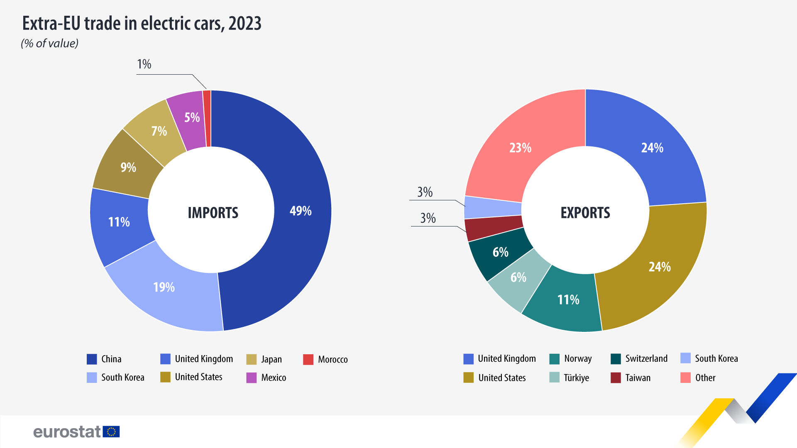

```{r setup, include=FALSE}
knitr::opts_chunk$set(echo = TRUE)
library(dplyr)
library(ggplot2)
library(patchwork)


```

**Wizualizacja źródłowa: https://ec.europa.eu/eurostat/web/products-eurostat-news/w/ddn-20241030-2 **

**data publikacji: 30.10.2024**

**Co wymaga poprawy: **
**Wizualizacja przedstawia wykresy kołowe procentowego udziału państw w odpowiednio imporcie i eksporcie aut elektrycznych z UE. Ze względu na wieloelementowy podział wykresu i użycie podobnych kolorów dla oznaczenia państw wykresy nie są czytelne, wymagają dokładnego zapoznania się z legendą i zapamiętania czemu odpowiadają poszczególne odcienie niebieskiego i zielonego **

```{r wizualizacja źródłowa, message=FALSE}
  
```
**Propozycja alternatywnej wizualizacji:**


```{r my, message=FALSE,results='hide',fig.show='hold', fig.width=20, fig.height=12}
library(dplyr)
library(ggplot2)
library(patchwork)

Import <- data.frame(c("China", "United Kingdom", "Japan", "Moroco", "South Korea", "United States", "Mexico"), c(49, 11, 7, 1, 19, 9, 5))
colnames(Import) <- c("Countries", "Values")
Import <- Import %>% 
  arrange(-Values)
Import$Countries <- factor(Import$Countries, levels = Import$Countries)

imp <- ggplot(Import, aes(y = Countries, x = Values)) +
  geom_col(fill = "lightblue") +
  labs(title = "Imports", y = "Countries", x = "Contribution to Total imports [%]") +
  theme_minimal() +
   theme(
    legend.position = element_blank(),
    plot.title = element_text(size = 30, face = "bold"),        
    plot.subtitle = element_text(size = 22),                    
    axis.title = element_text(size = 20),                       
    axis.text = element_text(size = 18)                         
  )+
  geom_text(aes(label = paste0(Values, "%"),
                hjust = ifelse(Values > 20, 1.2, -0.2)),  
            size = 5)  

# Export data
Export <- data.frame(c("Norwey", "United Kingdom", "Switzerland", "Türkiye", "South Korea", "United States", "Taiwan"), c(24, 11, 6, 3, 24, 6, 3))
colnames(Export) <- c("Countries", "Values")
Export <- Export %>% 
  arrange(-Values)
Others <- data.frame("Others", 23)
colnames(Others) <- c("Countries", "Values")
Export[8, ] <- Others[1, ]
Export$Countries <- factor(Export$Countries, levels = Export$Countries)

exp <- ggplot(data = Export, aes(x = Values, y = as.factor(Countries))) +
  geom_col(fill = "#dd6666") +
  labs(title = "Exports", y = "Countries", x = "Contribution to Total exports [%]") +
  theme_minimal() +
 theme(
    legend.position = element_blank(),
    plot.title = element_text(size = 30, face = "bold"),        
    plot.subtitle = element_text(size = 22),                    
    axis.title = element_text(size = 20),                       
    axis.text = element_text(size = 18)                         
  )+
  geom_text(aes(label = paste0(Values, "%"),
                hjust = ifelse(Values > 20, 1.2, -0.2)),  
            size = 5)  

# Combine the plots
imp + plot_spacer() + exp + plot_layout(ncol = 3, width = c(8, 1, 8), guides = "collect") +
  guide_area() +
  plot_annotation(
    title = "Extra-EU trading in electric cars, 2023",
    subtitle = "(% of value)",
    theme = theme(
      plot.title = element_text(size = 30, face = "bold"), 
      plot.subtitle = element_text(size = 20) 
    )
  )

```
**Uzasadnienie:**

**Wykorzystanie wykresów słupkowych pozwala na łatwiejsze porównanie wartości między krajami, dzięki uporządkowaniu danych w czytelny sposób. Jednolite kolory na każdym wykresie upraszczają odbiór informacji i eliminują potencjalne trudności w rozróżnianiu podobnych odcieni. Jasno oznaczone osie ułatwiają szybkie zrozumienie danych i porównanie wartości.**