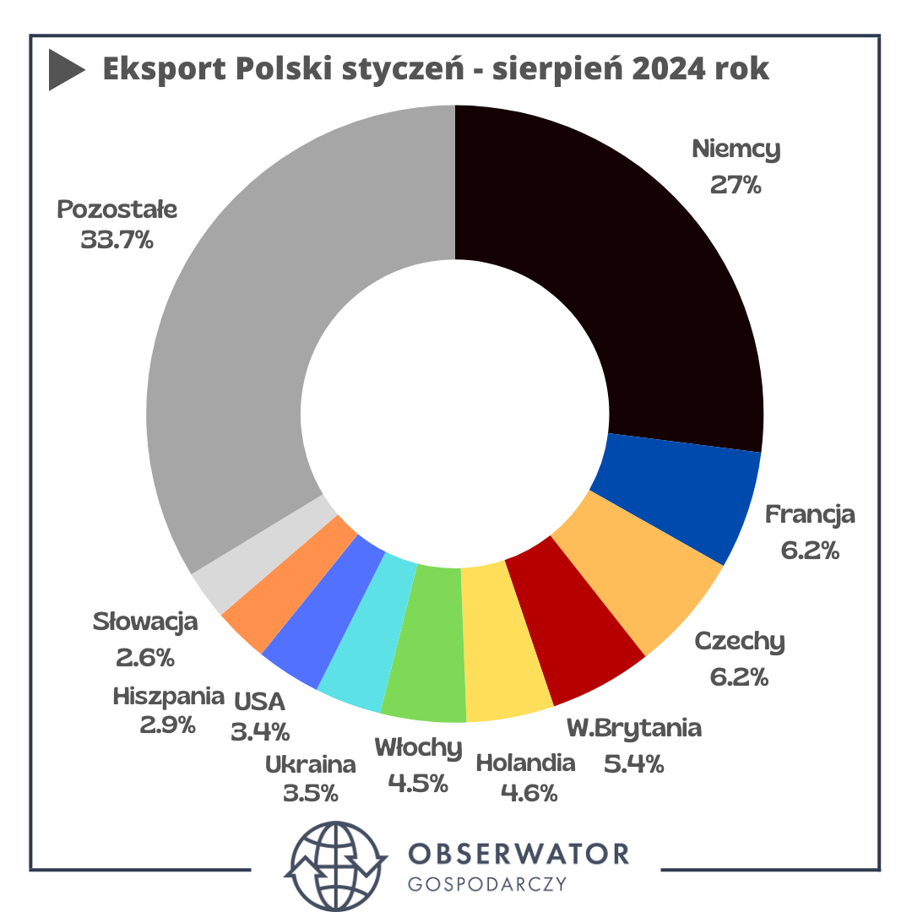

```{r setup, include=FALSE}
knitr::opts_chunk$set(echo = TRUE)
library(dplyr)
library(tidyr)
library(ggplot2)
```

## Wykres błędny

**Źródło:** <https://obserwatorgospodarczy.pl/2024/10/15/eksport-polski-doluje-winne-niemcy-i-silny-zloty/>



**Komentarz:** Wykres jest kołowy i zawiera wiele państw, co sprawia, że pola odpowiadające państwom mogą być bardzo podobne i trudne do porównania bez patrzenia na wartość procentową.

## Wykres poprawiony

```{r, message=FALSE}
data.frame(
  Country = factor(c("Niemcy", "Francja", "Czechy", "Wielka Brytania", 
                     "Holandia", "Włochy", "Ukraina", "USA", "Hiszpania", 
                     "Słowacja", "Pozostałe"), 
           levels = c("Niemcy", "Francja", "Czechy", "Wielka Brytania",
                      "Holandia", "Włochy", "Ukraina", "USA", "Hiszpania", 
                      "Słowacja", "Pozostałe")),
  Percent = c(27.0, 6.2, 6.2, 5.4, 4.6, 4.5, 3.5, 3.4, 2.9, 2.6, 33.7)
) %>% 
  mutate(Percent = Percent / 100) %>% 
  ggplot(aes(x = Country, y = Percent, fill = Country)) +
  geom_col() +
  geom_text(aes(label = scales::percent(Percent, accuracy = 0.1)), vjust = -0.3, size = 3.5) +
  scale_fill_manual(values = c(
    "#000000", "#003366", "#FF0000", "#ADD8E6", "#FFA500", "#008000", "#FFFF00",
    "#8B0000", "#F0E68C", "#0000FF", "#A9A9A9"   
  )) +
  scale_y_continuous(labels = scales::percent_format()) +
  theme_minimal() +
  theme(legend.position = "none", axis.text.x = element_text(angle = 60, hjust = 1)) +
  labs(title = "Eksport Polski styczeń - sierpień 2024 rok",
       x = "Kraj", y = "Procent eksportu")

```

**Komentarz:** Wykres został zmieniony na wykres słupkowy, co pozwala na łatwiejsze porównanie wartości procentowych. Dodatkowo, zmienione zostały kolory, gdyż niektóre kolory były bardzo podobne do siebie.
