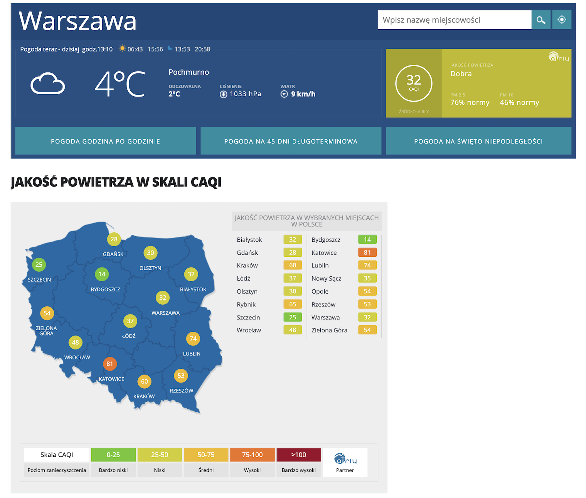

```{r setup, include=FALSE}
knitr::opts_chunk$set(echo = TRUE)
library(dplyr)
library(ggplot2)
library(rnaturalearth)
library(sf)
library(ggrepel)
library(patchwork)
library(grid)
library(gridExtra)
```

## Źródło 
Wykres pochodzi ze strony: (https://pogoda.interia.pl/jakosc-powietrza) z dnia 2024-11-07


## Błędy
Część informacji o zanieczyszczeniu powietrza została podana dwukrotnie tzn. tabelka po prawej stronie opisuje dokładnie te same
dane co wykres Polski po lewej stronie. Kolejnym mankamentem jest brak precyzjii skali i jej przedziałów. Odbiorca nie może odczytać
czy np. wartość "50" należy do przedziału "średni" czy "niski".

## Poprawa
Dane do ramki danych zostały wzięte ze strony https://airly.org/map/pl/#52.2288734135,21.0176386709
```{r zadanie 1, message=FALSE}
locations <- c("Białystok", "Gdańsk", "Kraków", "Łódź", "Olsztyn", "Rybnik", "Szczecin", "Wrocław",
               "Bydgoszcz", "Katowice", "Lublin", "Nowy Sącz", "Opole", "Rzeszów", "Warszawa", "Zielona Góra")
air_quality <- c(32, 28, 60, 37, 30, 65, 25, 48, 14, 81, 74, 35, 54, 53, 32, 54)
latitude <- c(53.13, 54.35, 50.06, 51.77, 53.78, 50.10, 53.43, 51.11, 53.12, 50.26, 51.25, 49.62, 50.67, 50.03, 52.23, 51.94)
longitude <- c(23.16, 18.65, 19.94, 19.46, 20.49, 18.54, 14.55, 17.03, 18.00, 19.03, 22.57, 20.70, 17.93, 22.01, 21.01, 15.51)

air_quality_data <- data.frame(Location = locations, Air_Quality = air_quality, Latitude = latitude, Longitude = longitude)

air_quality_data<-air_quality_data%>%
  mutate(air_quality_string=case_when(Air_Quality<=25~"Bardzo niski",
                                      Air_Quality<=50~"Niski",
                                      Air_Quality<=75~"Średni",
                                      Air_Quality<=100~"Wysoki",
                                      TRUE~"Bardzo wysoki"),
         binning=cut(Air_Quality,c(0,25,50,75,100)))


poland_map <- map_data("world", region = "Poland")

colors <- c("#8BC34A", "#CDDC39", "#FFC107", "#FF5722", 
            "#B71C1C")

poland <- ne_states(country = "Poland", returnclass = "sf")

p1<-ggplot(data = poland) +
  geom_sf(fill = "#B0C4DE", color = "black") +
  geom_point(data = air_quality_data, aes(x = Longitude, y = Latitude,color=air_quality_string),
             alpha = 0.7,size=15)+
  geom_text(data=air_quality_data, aes(x = Longitude, y = Latitude, label = Air_Quality),color="white")+
  geom_text_repel(data = air_quality_data, aes(x = Longitude, y = Latitude, label = Location,
                                               size = 9),point.size = 10) +
  scale_color_manual(values=colors)+
  labs(title="Jakość powietrza w wybranych miejscach w Polsce w skali CAQI",
       subtitle="07-11-2024")+
  theme_minimal()+
  theme_void()+
  theme(legend.position = "None",plot.title = element_text(size = 20))


table<-data.frame("Jakość powietrza"=unique(air_quality_data$air_quality_string),"Skala CAQI"=unique(air_quality_data$binning))
last_row=data.frame("Jakość powietrza"="Bardzo wysoki","Skala CAQI"=">100")
new_order <- c(3, 1, 2, 4,5)

table<-rbind(table,last_row)
table<-table[new_order,]

my_table_theme <- ttheme_default(core=list(bg_params = list(fill = colors, col=NA)))
rownames(table) <- NULL
table<-gridExtra::tableGrob(table, theme = my_table_theme)


```


```{r fig.width=12, fig.height=9, echo=FALSE}
combined_plot <- p1 + table + plot_layout(ncol = 2, widths = c(3, 1))
combined_plot
```

**Komentarz: Poprawiona  skala oraz usunięcie informacjii, które zostały podane dwukrotnie**