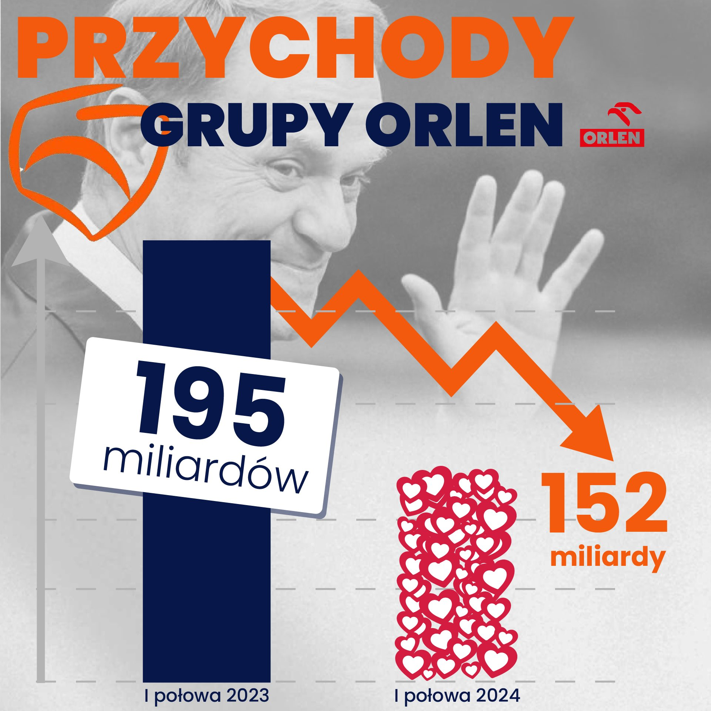

```{r setup, include=FALSE}
knitr::opts_chunk$set(echo = TRUE)
library(dplyr)
library(tidyr)
library(ggplot2)
library(ggpattern)
library(cowplot)
library(magick)
df <- data.frame(
  okres = c("I połowa 2023", "I połowa 2024"),
  przychody = c(195, 152)
)
```

## Źródło

Źródłem do pracy dowomej 3 jest tweet byłego prezesa Orlenu Daniela Obajtka z dnia 31.10.2024r.
W tweecie załączony jest wykres dotyczący spadku przychodów firmy po zmianie władzy w Polsce.

```{r echo=FALSE, out.width = "60%", fig.align = "center"}

```

Link: https://x.com/DanielObajtek/status/1852043393976934611?t=-98b1ljZZQfc4Yi1Zxt4XA&s=19

## Błędy w wizualizacji

W wykresie są dwa błędy:\
1. Proporcje między wysokością słupków są zakłamane. Drugi słupek jest o połowę
mniejszy od drugiego mimo, że wartość w drugim stanowi ponad 75% pierwszej. \
2. Dla pewnych wartości na osi Y wyznaczone są proste, które wyznaczone są dla niewiadomo jakich wartości i w różnych między sobą odległościach.


## Poprawiony wykres

```{r poprawionyWykres, echo = TRUE, fig.width=10, fig.height=10}

library(dplyr)
library(tidyr)
library(ggplot2)
library(cowplot)
library(magick)
df <- data.frame(
  okres = c("I połowa 2023", "I połowa 2024"),
  przychody = c(195, 152)
)

p1 <- ggplot(df, aes(x = okres, y = przychody)) +
  geom_col(fill = c("navyblue", "white"), color = "black") +
  labs(title = "Przychody grupy Orlen", y = "Przychody [mld zł]") +
  theme_minimal() + 
  theme(axis.title.x = element_blank())


serduszko <- ggdraw() + draw_image("img/serduszko.png", x = 0.24, y = .95, scale = 0.45)

poprawionyWykres <- plot_grid(p1, serduszko, ncol = 1) + 
  coord_fixed(ratio = 1)
print(poprawionyWykres)
  
  
```

## Naniesione poprawki

Nowy wykres przedstawia inną i zarazem poprawną proporcję między przychodami
 w pierwszym i drugim okresie. Dodatkowo oś y odpowiadająca za przychody firmy 
 ma dostępne wartości i każda przedstawiona prosta dla konkretnej wartości jest 
 stale odległa od poprzedniej o 50.


