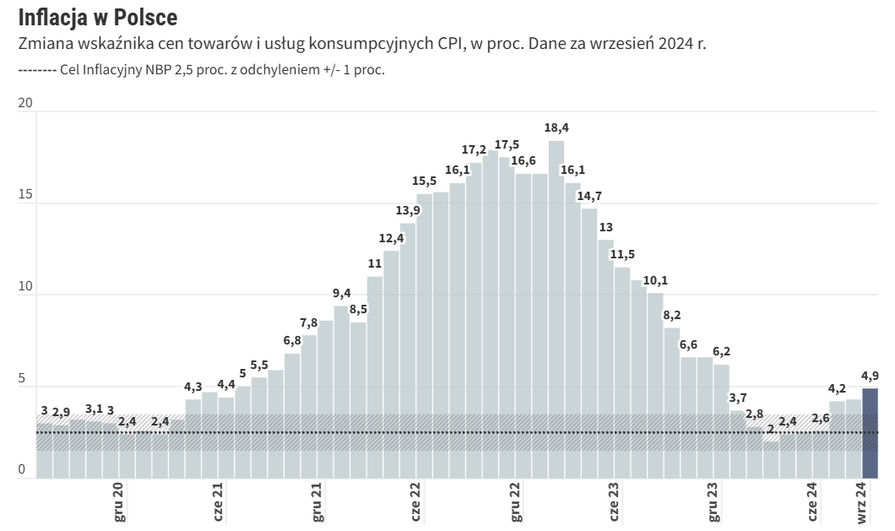

```{r setup, include=FALSE}
knitr::opts_chunk$set(echo = TRUE)
library(dplyr)
library(ggplot2)
library(readxl)
df <- read_excel("bazowa.xlsx", sheet = 1)
```





**Komentarz**:
Ten wykres nie jest idealny, ponieważ nie jest wystarczająco czytelny. Osie nie są wystarczająco
dobrze opisane - występują luki w datach, a oś y nie ma tytułu. 

```{r zadanie 1, message=FALSE}

df <- read_excel("bazowa.xlsx", sheet = 1)  

df <- df %>% 
  select(c('...1','...2'))

df <- df[-c(1,2), ]
colnames(df) <- c('date','CPI')
df <- na.omit(df)
df <- df %>%
  mutate(date = format(as.Date(date), "%Y-%m")) %>%
  filter(date >= '2020-07') %>%
  mutate(year = substr(date, 1, 4), 
         month = as.numeric(substr(date, 6, 7))) %>% 
  mutate(month = case_when(
    month == 1 ~ 'sty',
    month == 2 ~ 'lut',
    month == 3 ~ 'mar',
    month == 4 ~ 'kwi',
    month == 5 ~ 'maj',
    month == 6 ~ 'cze',
    month == 7 ~ 'lip',
    month == 8 ~ 'sie',
    month == 9 ~ 'wrz',
    month == 10 ~ 'paz',
    month == 11 ~ 'lis',
    month == 12 ~ 'gru'
  ))

df$date <- paste(df$year,df$month)
df <- df %>% 
  mutate(CPI = as.numeric(CPI) - 100)
df$CPI <- round(df$CPI, 1)
df <- df %>%
  mutate(date = factor(date, levels = unique(date))) %>%
  arrange(date) 
df <- df %>%
  mutate(last_bar = ifelse(row_number() == n(), "last", "other"),
         year_factor = factor(year))  


ggplot(df, aes(x = date, y = CPI, fill = interaction(year_factor, last_bar))) +
  geom_bar(stat = "identity", show.legend = F) +
  geom_text(aes(label = round(CPI, 1)),vjust = -0.5, color = "black", size = 2, fontface = 'bold') + 
  labs(title = "Inflacja w Polsce",subtitle = "Zmiana wskaźnika cen towarów i usług konsumpcyjnych CPI, w proc. Dane za wrzesień 2024 r.",
       x = "Data", y = "Wskaźnik CPI (w %)") +
  scale_fill_manual(values = c("2024.last" = "#1c2833", "2020.other" = "#d6dbdf", "2021.other" = "#aeb6bf",
                               "2022.other" = "#85929e", "2023.other" = "#5d6d7e",
                               "2024.other" = "#34495e")) + 
  geom_hline(aes(yintercept = 2.5, linetype = "Cel inflacyjny NBP 2,5 proc. z odchyleniem +/- 1 proc."), color = "black", size = 0.75) + 
  scale_linetype_manual(values = c("Cel inflacyjny NBP 2,5 proc. z odchyleniem +/- 1 proc." = "11")) + 
  guides(linetype = guide_legend(title = NULL)) +  
  theme_bw() +
  theme(plot.title = element_text(face = "bold", size = 14), 
        plot.subtitle = element_text(size = 10),
    axis.text.y = element_text(angle = 90, size = 10),
    axis.text.x = element_text(angle = 45, hjust = 1, size = 7),
    legend.position = "top")

```

**Komentarz:**
Poprawiony wykres zawiera dokładnie opisane osie (wiadomo już który słupek przedstawia jaki miesiąc i rok), a dodatkowo jest bardziej przejrzysty, ponieważ wyodrębnione są kolorami lata, co jeszcze dodaje wykresowi czytelności.


