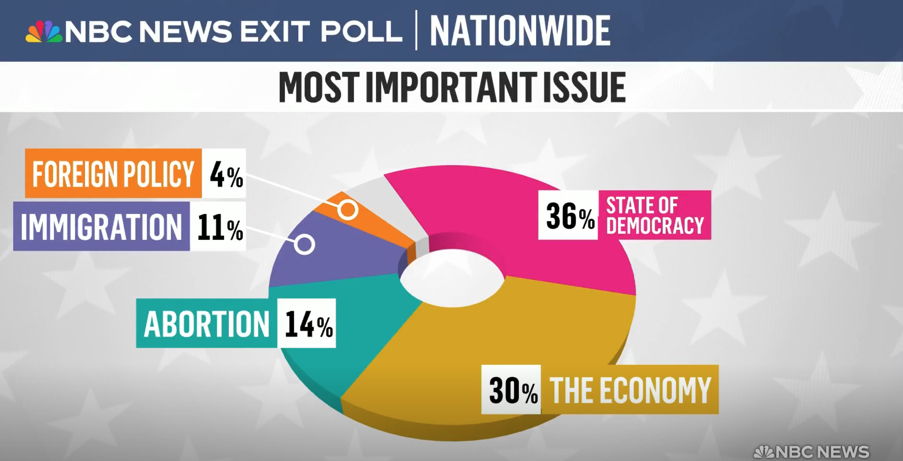

  
  ```{r setup, include=FALSE}
knitr::opts_chunk$set(echo = TRUE)
library(dplyr)
library(ggplot2)
```

## Niepoprawny Wykres
"https://www.nbcnews.com/video/first-exit-polls-reveal-data-across-america-223659077634" (4:00 minuta nagrania) wykres od 6 listopada 2024



Nie należy wykorzystywać kołowych wykresów, ciężko jest wizualnie porównywać kawałki koła. Zamiast można użyć barplot. Tym bardziej nie należy wykorzystywać 3d koła. Zbędna złożoność wykresu, jest mniej czytelny Tym bardziej na tym wykresie "The Economy" issue wygląda na większe od "State of Democracy". Dodatkowo nie wiadomo czym jest szary kawalek kola. Ale raczej są to inne issues, bo koło dotyczy issues które martwią osoby zdolne do głosowania.`README.md`.


## Poprawny Wykres

Ten wykres poprawnie pokazuje proporcj. Oraz zawiera wszystkie niezbędne informacje, w tym zaznaczony brakujący "Other" kawałek. Jest bardziej czytelniejszy.

```{r zadanie 1, message=FALSE}

library(ggplot2)
library(forcats)

data <- data.frame(
  Issue = c("State of Democracy", "The Economy", "Abortion", "Immigration", "Foreign Policy", "Other"),
  Percentage = c(36, 30, 14, 11, 4, 5)
)

data$Issue <- fct_reorder(data$Issue, data$Percentage, .desc = FALSE)


ggplot(data, aes(x = Issue, y = Percentage, fill = Issue)) +
  geom_col(width = 0.7) +
  labs(title = "Most Important Issues", x = "Issue", y = "Percentage (%)") +
  scale_fill_manual(values = c("State of Democracy" = "pink", 
                               "The Economy" = "#FFC107", 
                               "Abortion" = "#00BCD4", 
                               "Immigration" = "#9C27B0", 
                               "Foreign Policy" = "#FF5722",
                               "Other" = "grey")) +
  theme_minimal() +
  theme(legend.position = "none",
        plot.title = element_text(hjust = 0.5, face = "bold", size = 16),
        axis.text.y = element_text(size = 12),
        axis.text.x = element_text(size = 10, angle = 25, vjust = 0.7)) +
  geom_text(aes(label = paste0(Percentage, "%")), hjust = 0.5, vjust = 2, size = 5)    

```

