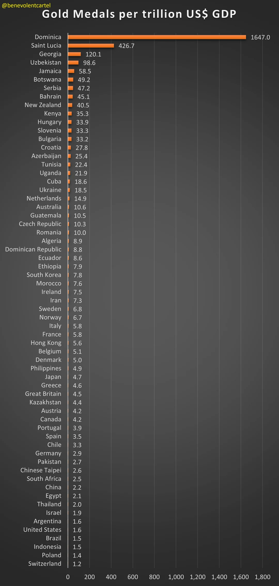
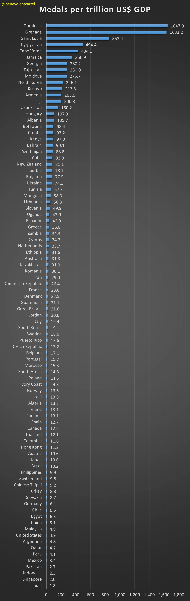

```{r setup, include=FALSE}
knitr::opts_chunk$set(echo = TRUE)
library(dplyr)
library(ggplot2)
library(tidyr)
library(ggrepel)
options(scipen = 999)
medals_df <- read.csv("medals_total.csv")
gdp_df <- read.csv("gdp_data.csv")
```

## Wyrkesy żródłowe

 

powyższe wyrkesy zostały opublikowane 03/11/2024

żródło: <https://www.reddit.com/r/dataisbeautiful/s/7Od0CA7uYK>

w tych wizualizacjach został użyty niepoprawny typ wykresu, przez to słabo widać badane zależności poza parą outlierów

## Poprawione wykresy

```{r poprawiony wykres 1, message=FALSE, warning=FALSE}
tmp <- gdp_df %>% select(X2023, Country.Code) %>% 
  filter(!is.na(X2023)) %>% 
  inner_join(medals_df, by = c("Country.Code" = "country_code")) %>% 
  mutate(gdp = X2023/1000000000)

ggplot(tmp, aes(x = gdp, y = Gold.Medal, label = country)) +
  geom_point(size = 2.5, color = "orange", alpha = 0.5) +
  scale_x_log10()+
  geom_text_repel() + 
  labs(title = "Gold medals in Paris 2024 olympics to GDP",
       x = "GDP in bilions USD (log)",
       y = "Number of gold medals")
```

```{r poprawiny wykres 2, message=FALSE, warning=FALSE}
ggplot(tmp, aes(x = gdp, y = Total, label = country)) +
  geom_point(size = 2.5, color = "navy", alpha = 0.5) +
  scale_x_log10()+
  geom_text_repel() + 
  labs(title = "All medals in Paris 2024 olympics to GDP",
       x = "GDP in bilions USD (log)",
       y = "Number of medals")
```

na poprawinych wykresach widoczny jest wzrost liczby medali wraz z PKB
