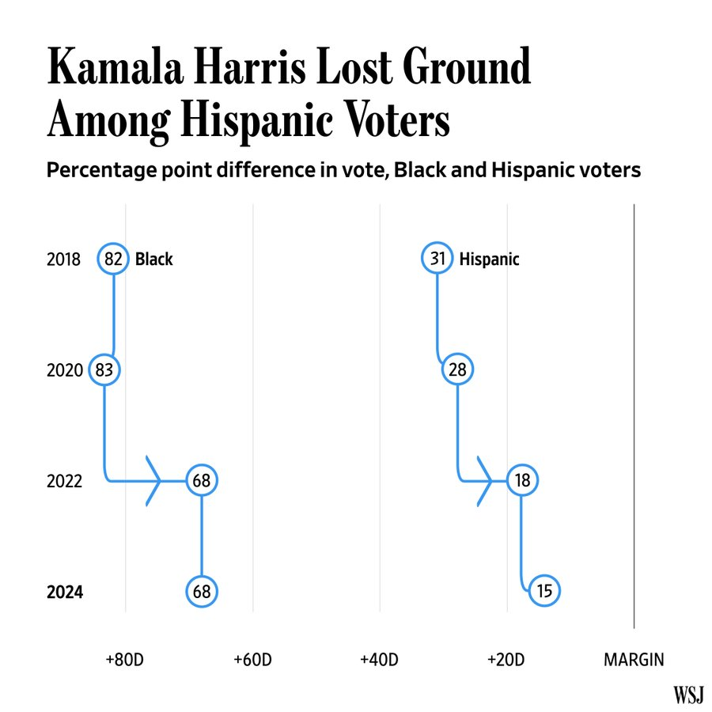

```{r setup, include=FALSE}
knitr::opts_chunk$set(echo = TRUE)
```

### Wizualizacja źródłowa, która wymaga poprawy:


Źródło: https://www.wsj.com/politics/elections/election-2024-voters-demographics-votecast-survey-5a21c604?mod=e2tw  
Data publikacji: 9 listopada 2024r.


### Dlaczego ten wykres wymaga poprawy?

Wykres jest mało czytelny i nieintuicyjny. Pierwsza rzecz, która od razu rzuca się w oczy to nietypowy wybór formy wykresu. Dodatkowo, oś x przedstawia niezrozumiałe wartości które nie są dokładnie opisane, co uniemożliwia proste zrozumienie co wykres przedstawia. Lata na osi y są zaznaczone w kolejności malejącej, co też może być mylące. Poza tym, wartości procentowe są pokazane tylko przez konkretne liczby, co uniemożliwia szybkie zauważenie różnicy w głosach. Nieintuicyjne jest również to, że dane są przedstawione jako: rok na osi y, wartość procent na osi x. Zazwyczaj czas umieszcza się na osi x, a wartości na osi y. Ostatnim problemem tego wykresu jest tytuł, który niejasno opisuje  w jakim kontekście są przedstawione te dane.


### Poprawiony wykres:

```{r, echo=TRUE, warning=FALSE, message=FALSE}
library(ggplot2)

data <- data.frame(
  Rok = rep(c(2018, 2020, 2022, 2024), 2),
  Grupa = rep(c("Black", "Hispanic"), each = 4),
  Procent = c(82, 83, 68, 68, 31, 28, 18, 15)
)

ggplot(data, aes(x = factor(Rok), y = Procent, fill = Grupa)) +
  geom_bar(stat = "identity", position = "dodge", width = 0.7) +
  scale_fill_manual(values = c("Black" = "blue", "Hispanic" = "orange")) +
  geom_text(aes(label = sprintf("%.0f%%", Procent)), 
            position = position_dodge(width = 0.7), 
            vjust = -0.5, size = 3.5) +
  labs(
    title = "Percentage of each group supporting the Democratic party",
    x = "Year",
    y = "Percent (%)",
    fill = "Group"
  ) +
  theme_minimal() +
  theme(
    plot.title = element_text(hjust = 0.5, face = "bold", size = 14),
    plot.subtitle = element_text(hjust = 0.5, size = 10),
    axis.text.x = element_text(angle = 45, hjust = 1),
    legend.title = element_text(face = "bold"),
    legend.position = "top"
  )


```

### Dlaczego poprawiony wykres jest lepszy od oryginalnego?

Ten wykres ma prostszą i bardziej czytelną formę, dobrze opisane osie oraz tytuł, który dokładniej odzwierciedla problem wykresu. Ilość procent jest lepiej widoczna poprzez słupki, co łatwiej pomaga zauważyć różnice zarówno między obiema grupami etnicznymi, ale też wynikami w innych latach. Lata są ustawione chronologicznie i dane są też bardziej widoczne przez zastosowanie 2 różnych kolorów dla tych 2 grup.


