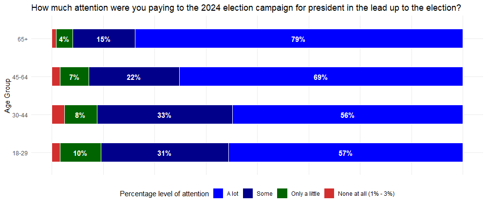

```{r setup, include=FALSE}
knitr::opts_chunk$set(echo = TRUE)
library(dplyr)
library(ggplot2)
```

## źródła

źródło wykresu: <https://www.statista.com/statistics/1422638/attention-presidential-campaigns-age-us/> , źródło danych: yougov.com , data publikacji: 11.11.2024

## Wykres przed zmianą


## Komentarz przed zmianą

Według mnie wykres nie jest do końca poprawny. Po pierwsze nie ma podpisanej osi wieku. Lepiej by się czytało gdyby wartości wieku były przedstawione liczbowo, bez dodawania słów takich jak "to", "and older". Dodatkowo oś x - procentowa jest myląca, ponieważ nie ma nic wspólnego z kolumnami na wykresie (one są już podpisane procentami oddzielnie). Możemy również zauważyć, że w dolnej kolumnie procenty na siebie nachodzą i ciężko jest odczytać co jest czym. Zmieniłabym również kolejność danych w każdej kolumnie, tzn zamiast od nawiększych procentów do najmniejszych, zrobiłabym na odwrót. I na koniec kolor szary często kojarzony jest z brakiem danych, więc uważam, że lepiej go zmienić.

```{r zadanie 1, message=FALSE}
data <- data.frame(
  AgeGroup = rep(c("18 to 29", "30 to 44", "45 to 64", "65 and older"), each = 4),
  AttentionLevel = factor(rep(c("A lot", "Some", "Only a little", "None at all"), times = 4), 
                          levels = c("A lot", "Some", "Only a little", "None at all")),
  Percentage = c(57, 31, 10, 2, 56, 33, 8, 3, 69, 22, 7, 2, 79, 15, 4, 1)
)

data <- data %>%
  mutate(AgeGroup = recode(AgeGroup,
                           "18 to 29" = "18-29",
                           "30 to 44" = "30-44",
                           "45 to 64" = "45-64",
                           "65 and older" = "65+")) %>% 
  mutate(AttentionLevel = recode(AttentionLevel,
                           "None at all" = "None at all (1% - 3%)"))
  

g <- ggplot(data, aes(y = AgeGroup, x = Percentage, fill = AttentionLevel)) +
  geom_bar(stat = "identity", position = "fill", width = 0.5, color = "white") + 
  geom_text(aes(label = ifelse(Percentage > 3, paste0(Percentage, "%"), "")),
            position = position_fill(vjust = 0.5), size = 4, color = "white", fontface = "bold") +
  labs(title = "How much attention were you paying to the 2024 election campaign for president in the lead up to the election?",
       y = "Age Group", x = NULL,
       fill = "Percentage level of attention") +
  scale_x_continuous(labels = NULL) + 
  scale_fill_manual(values = c("None at all (1% - 3%)" = "#D32F2F",
                               "Only a little" = "#006400",
                               "Some" = "#00008B",
                               "A lot" = "#0000FF")) +
  theme_minimal() +
  theme(legend.position = "bottom")
       
```

## Wykres po zmianie



## Komentarz po zmianie

Nowo powstały wykres ma zmienione opisy osi oraz wartości na nich. Dodatkowo ma dodaną nazwę legendy. Zmieniona jest kolejność poszczególnych kafelków w kolumnach: od najmniejszej do największej. Dzięki odpowiedniemu zapisie wartości procentów nie nachodzą na siebie.
