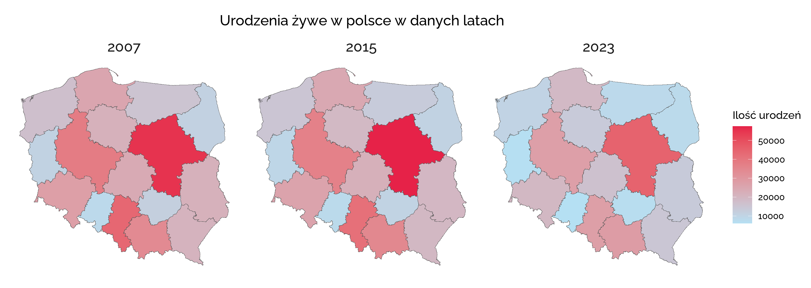
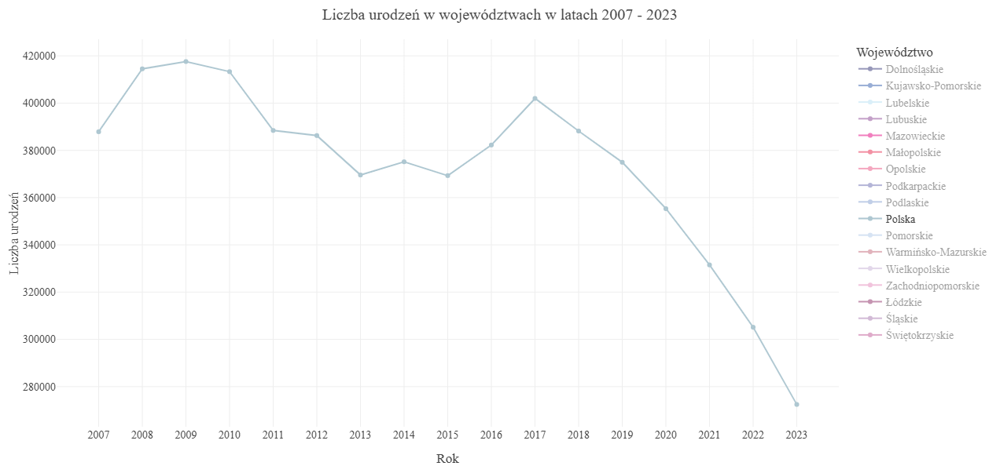
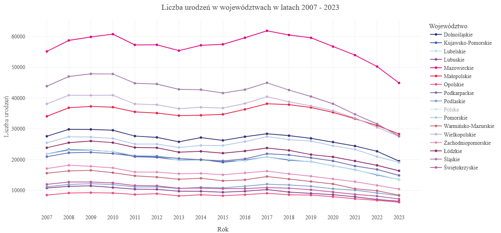

```{r setup, include=FALSE}
knitr::opts_chunk$set(echo = TRUE)


```

## Mapa 

Mapa przedstawia ilość żywych urodzeń w Polsce w 2007, 2015 i 2023 w danych województwach. Została stworzona za pomocą pakietów ggplot, sf oraz geodata.




**Wnioski: Widać, że ilość żywych urodzeń w Polsce maleje (wynika to z tego, że ogółem rodzi się mniej dzieci) oraz, że udział procentowy województw we wszystkich urodzeniach nie zmienia się na przestrezni lat - województwo mazowieckie ma największy udział.**

## Animacja - wykres liniowy

Wykres przedstawia jak na przestrzeni lat 2007 - 2023 zmienia się ilość żywych urodzeń w danym województwie. Można wybrać dla których województw chce się zobaczyć zależność. Animacja zrobiona za pomocą pakietu plotly.

Polska 

Województwa


**Wnioski: Każde województwo ma podobny rozkład danych. Widać, że od roku 2017 liczba urodzeń maleje.**


