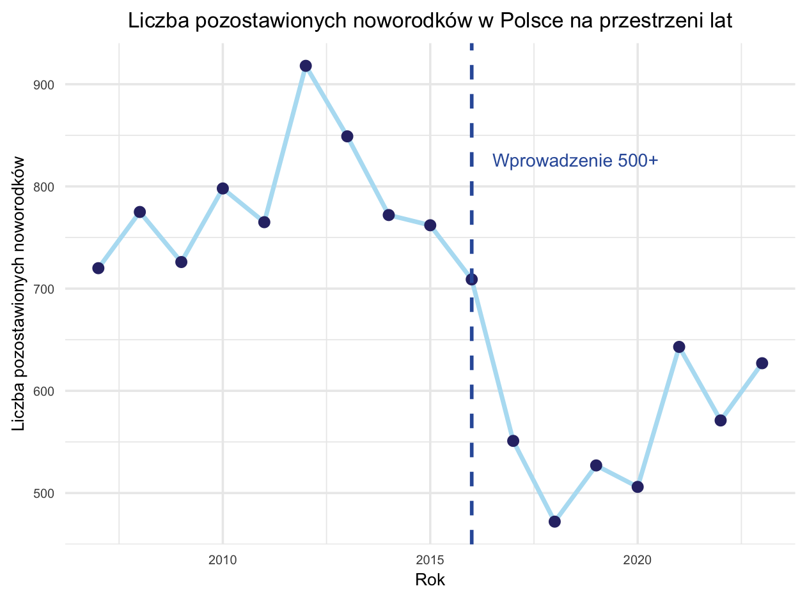
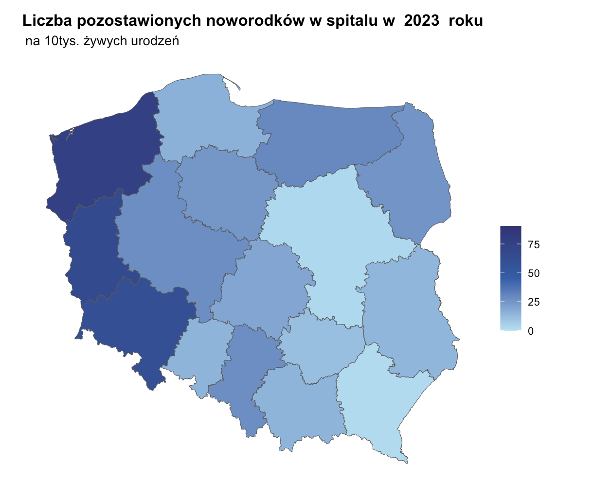
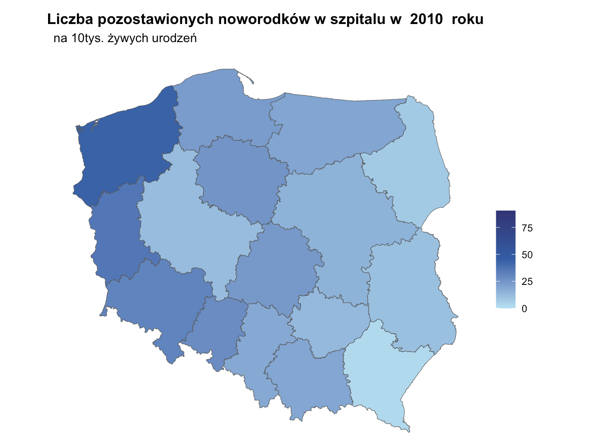

# Jak zmienia sie problem (pozostawienia noworodkow w Szpitalu) w Polsce na przestrzeni lat?

Wykorzystano dane o urodzeniach żywych w Polsce na przestrzeni lat oraz dane
o noworodkach pozostawionych w szpitalu nie z powodów zdrowotnych(dane z podzialem na lata), 
Uwzględnieniono aspekt zbierania
danych na przestrzeni lat, co umożliwiło pokazanie rozwoju problemu oraz jego 
tendencji z latami. Rowniez uwzgledniona dodatkowa informacja
o wprowadzeniu programu 500+ 1 kwietnia 2016

Wizualizacja przedstawia skale oraz ogolny rozwoj problemu w Polsce
Wyrozniony zostal miesiac wprowadzenia "500+", widac ze program
przyczynil sie do polepszenia problemu na okres okolo 3 lat,
jednak po 2018-2019 problem znowu zaczal sie nasilac
mozna zauwazyc tendecje rosnace (2007 - 2012) oraz 2019 - 2023
oraz spadkowa 2012 - 2019

Pomysl do dalszego realizowania:

dodac do aplikacji shiny mozliwosc wyboru (osobnie wojewodztwa oraz opcjii
"przestrzen lat") i wyswietlac wykresy podobne do poprzedniego interaktywnie dla
posczegolnego wojewodztwa

# Jak sie prezentuje  problem (pozostawienia noworodkow w Szitalu) posczegolnych wojewodztwach w poszczegolnych latach

Wykorzystano dane o urodzeniach żywych w Polsce na przestrzeni lat oraz dane
o noworodkach pozostawionych w szpitalu nie z powodów zdrowotnych
(dane z podzialem na lata oraz wojewodztwa),
została pokazana skala problemu porzucenia noworodków w poszczególnych
województwach. Wykorzystano podział danych na województwa, co pozwoliło
na dokładną analizę regionalną.

Mozna zauwazyc, ze jest tendencja do wiekszego procentu pozostawionych noworodkow
w wojewodztwach polozonych na zachod, niz w tych na wschodzie Polski
