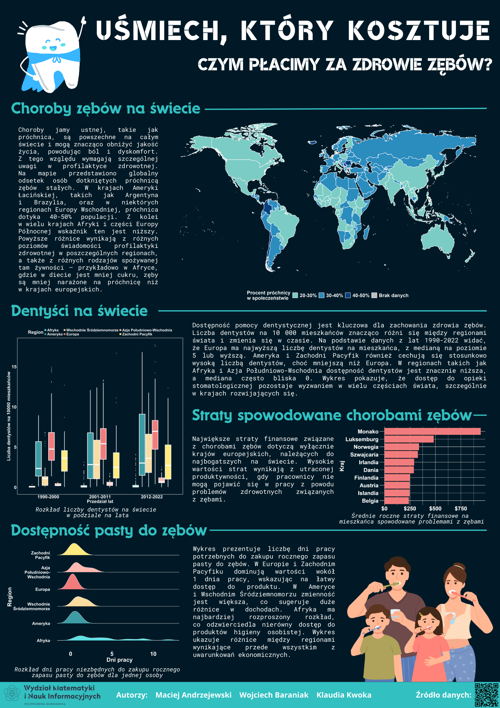

## Uśmiech, który kosztuje. Czym płacimy za zdrowie zębów?

Plakat przedstawia różne aspekty zdrowia jamy ustnej na świecie. Zawiera mapę ilustrującą globalne występowanie próchnicy zębów, wskazując na regionalne różnice w jej rozpowszechnieniu. Kolejne sekcje analizują dostępność dentystów w różnych regionach oraz pokazują zmiany w czasie. 
Znajdują się tu również dane o stratach finansowych spowodowanych chorobami zębów oraz porównanie liczby dni pracy potrzebnych na zakup pasty do zębów w różnych częściach świata. Plakat ukazuje nierówności w dostępie do opieki stomatologicznej oraz ekonomiczne konsekwencje problemów zdrowotnych zębów.

Autorzy: Maciej Andrzejewski, Wojciech Baraniak, Klaudia Kwoka

Żródło danych:
- https://www.who.int/data/gho/data/themes/oral-health-data-portal

