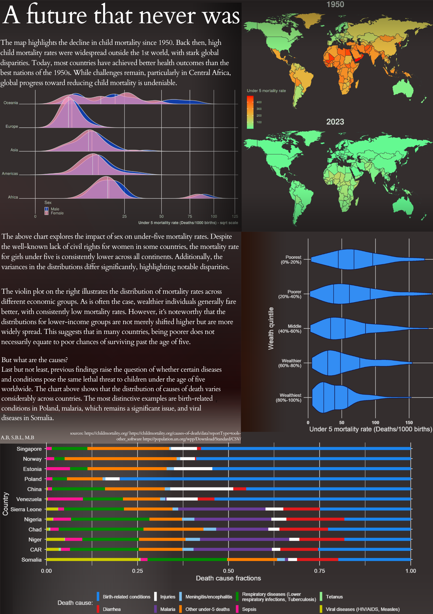

## A future that never was

The poster was created by the team consisting of Sebastian Botero Leonik, Mikołaj Bójski and Aleksander Brandt, during the 2024/2025 winter semester, in the course 'Data Visualization Techniques' at Warsaw University of Technology. It focuses on mortality rate for children under the age of five. We explored the influence of factors such as sex, country and wealth on this notorious rate. Furthermore, we showed the tremendous improvement in this aspect since 1950.

Authors: Sebastian Botero Leonik, Mikołaj Bójski, Aleksander Brandt

Source:
- https://childmortality.org/
- https://childmortality.org/causes-of-death/data?reportType=tools-other_software
- https://population.un.org/wpp/Download/Standard/CSV/

