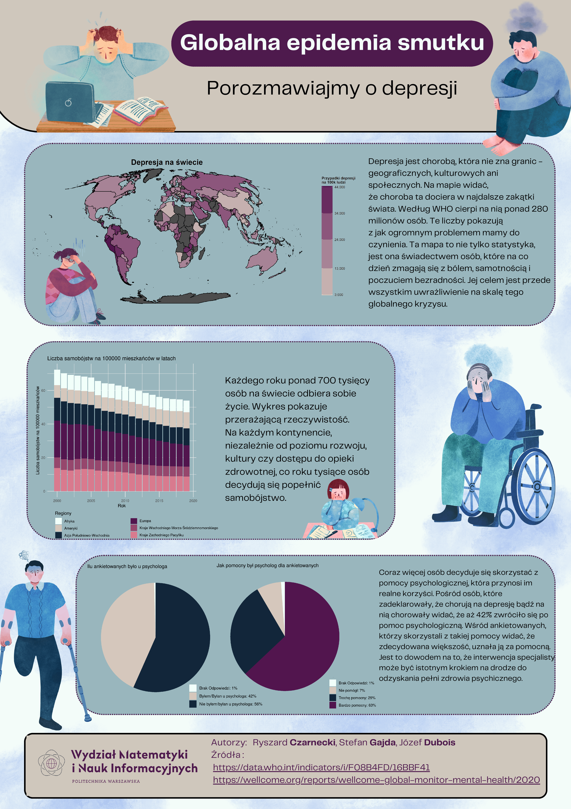

## Globalna epidemia smutku

Plakat przedstawia częstość występowania depresji, jej skutki oraz wpływ psychologów na ludzi z depresją. Zawiera mapę ilustrującą globalne występowanie depresji. Kolejna sekcja pokazuje zmianę liczby depresji w czasie. Ostatnia sekcja pokazuje jak potrzebni są psychologowie w walce z depresją.

Autorzy: Józef Dubois, Ryszard Czarnecki, Stefan Gajda

Żródła danych:
- https://data.who.int/indicators/i/F08B4FD/16BBF41
- https://wellcome.org/reports/wellcome-global-monitor-mental-health/2020

