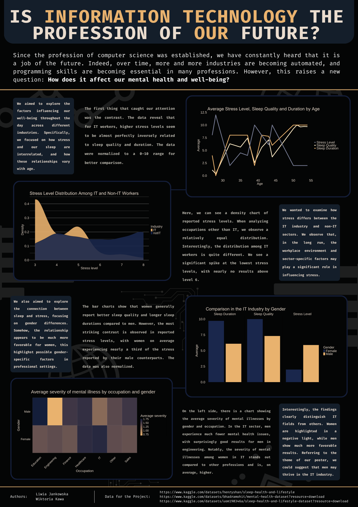

## Is Information Technology the profession of OUR future?

Plakat analizuje dane dotyczące stresu, snu i zdrowia psychicznego wśród pracowników IT, porównując je z trendami obserwowanymi w innych zawodach.

Autorzy: Liwia Jankowska, Wiktoria Kawa.

Źródła danych:
- [Sleep Health and Lifestyle Dataset](https://www.kaggle.com/datasets/henryshan/sleep-health-and-lifestyle)
- [Mental Health Dataset](https://www.kaggle.com/datasets/bhadramohit/mental-health-dataset?resource=download)
- [Sleep Dataset](https://www.kaggle.com/datasets/uom190346a/sleep-health-and-lifestyle-dataset?resource=download)

