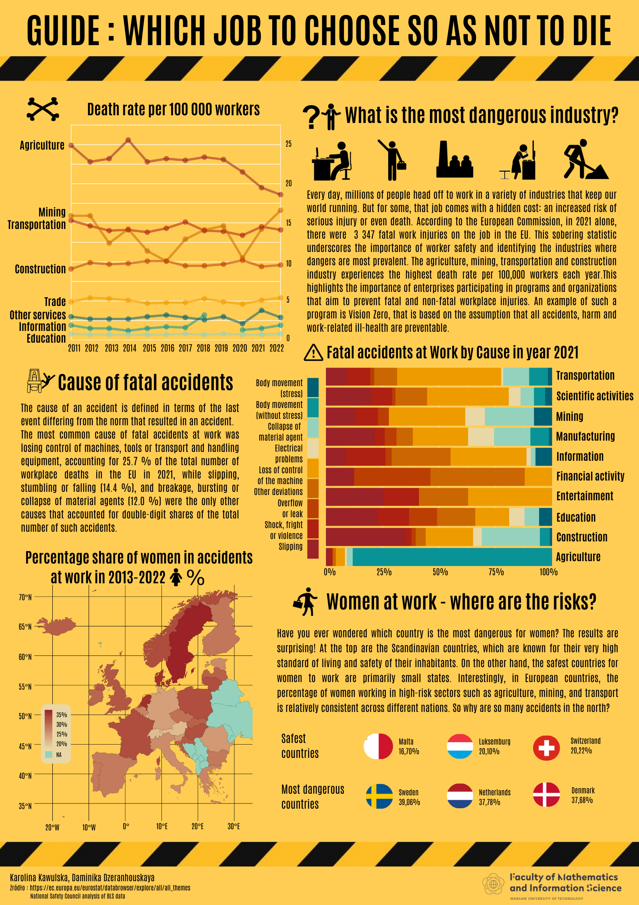

# GUIDE : WHICH JOB TO CHOOSE SO AS NOT TO DIE

Plakat przedstawia analizę danych dotyczących wypadków przy pracy w latach 2013-2022 w Europie. Skupiłyśmy się na śmiertelnych wypadkach w różnych branżach, na przyczynach wypadków śmiertelnych oraz na wypadkach kobiet w pracy. Przedstawiłyśmy dane na trzech wykresach.

Autorzy: 
- Karolina Kawulska
- Daminika Dzeranhouskaya

Źródła: 
- https://ec.europa.eu/eurostat/databrowser/explore/all/all_themes
- https://injuryfacts.nsc.org/work/industry-incidence-rates/most-dangerous-industries/

Uwagi:
Nie udało nam się dodać jednej ramki (hsw_ph3_06_tabular.tsv) do folderu kody, ponieważ plik był większy niż 25MB.
Udało się dodać tylko przez umieszczenie jej w zip-folderze. Także można ją znaleźć i pobrac wchodząc w pierwszy link ze źródeł.

