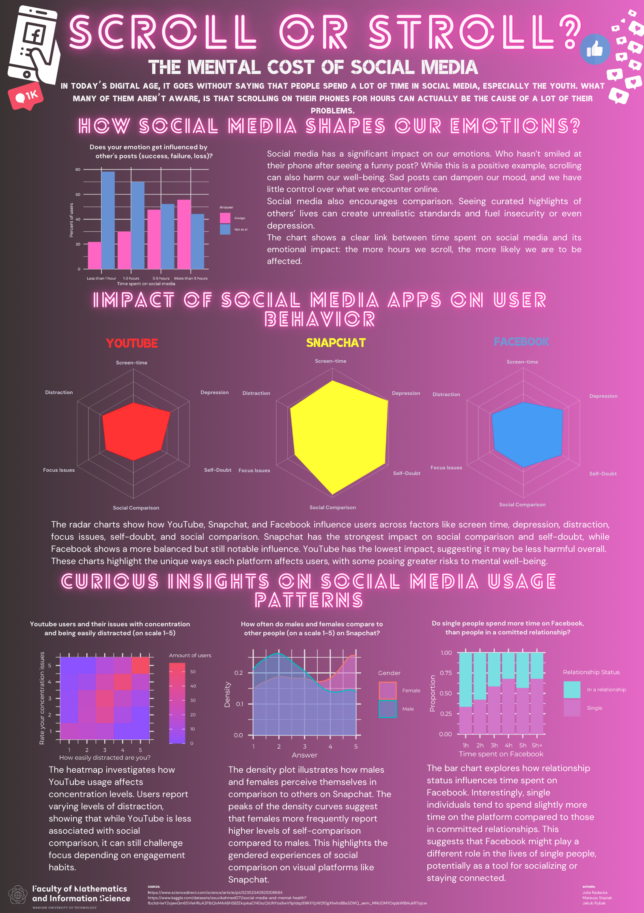

# Social Media and Mental Health

<!-- badges: start -->
<!-- badges: end -->

This poster explores the mental and emotional impact of social media usage, focusing on platforms like Facebook, Snapchat, and YouTube. It highlights how time spent on these apps influences factors such as distraction, self-doubt, social comparison, and depression. The visualizations showcase patterns in user behavior, including gender differences, relationship status, and how individuals compare themselves to others. The goal is to raise awareness about the potential risks of excessive social media use and encourage more mindful online habits.

Authors: Julia Radacka, Jakub Rybak, Mateusz Stasiak

Sources:

• https://www.sciencedirect.com/science/article/pii/S2352340921008684 

• https://www.kaggle.com/datasets/souvikahmed071/social-media-and-mental-health

