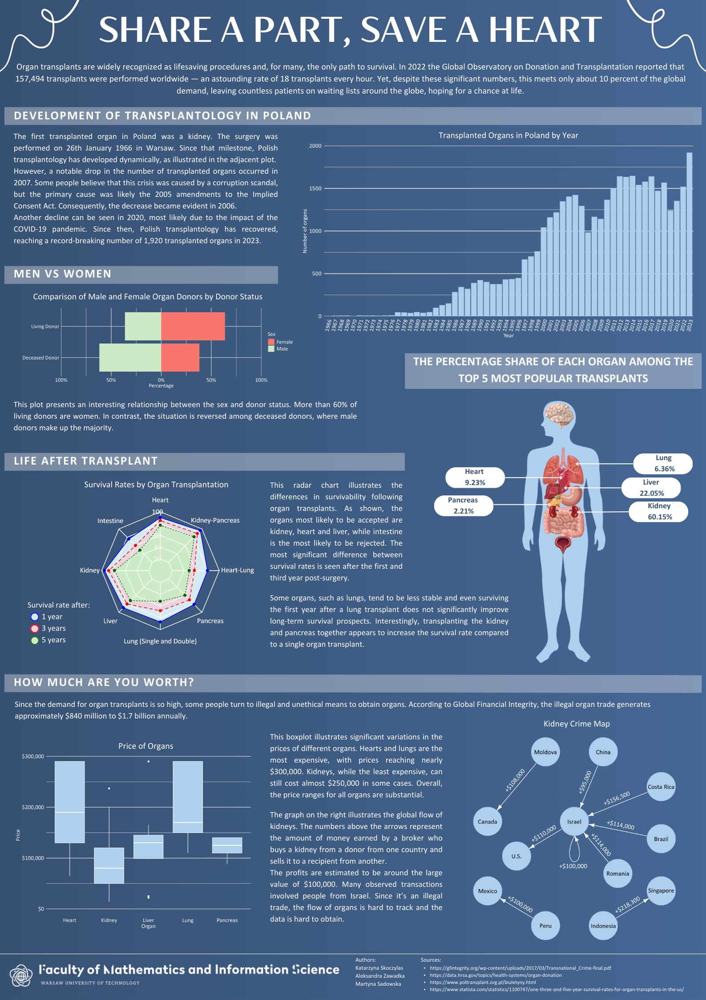

## SHARE A PART, SAVE A HEART

Our poster is about organ transplants. We analyzed the development of transplantology in Poland, including declines in the number of transplanted organs and their likely causes. We compared survival rates after transplanting different organs and examined the relationship between the sex and status of the donor. Additionally, we showed which organ transplants are the most common. Finally, we focused on illegal organ trade and the prices of various organs.

Authors: Katarzyna Skoczylas, Aleksandra Zawadka, Martyna Sadowska.

Sources:
- https://data.hrsa.gov/topics/health-systems/organ-donation
- https://www.poltransplant.org.pl/biuletyny.html
- https://www.statista.com/statistics/1100747/one-three-and-five-year-survival-rates-for-organ-transplants-in-the-us/
- https://gfintegrity.org/wp-content/uploads/2017/03/Transnational_Crime-final.pdf

