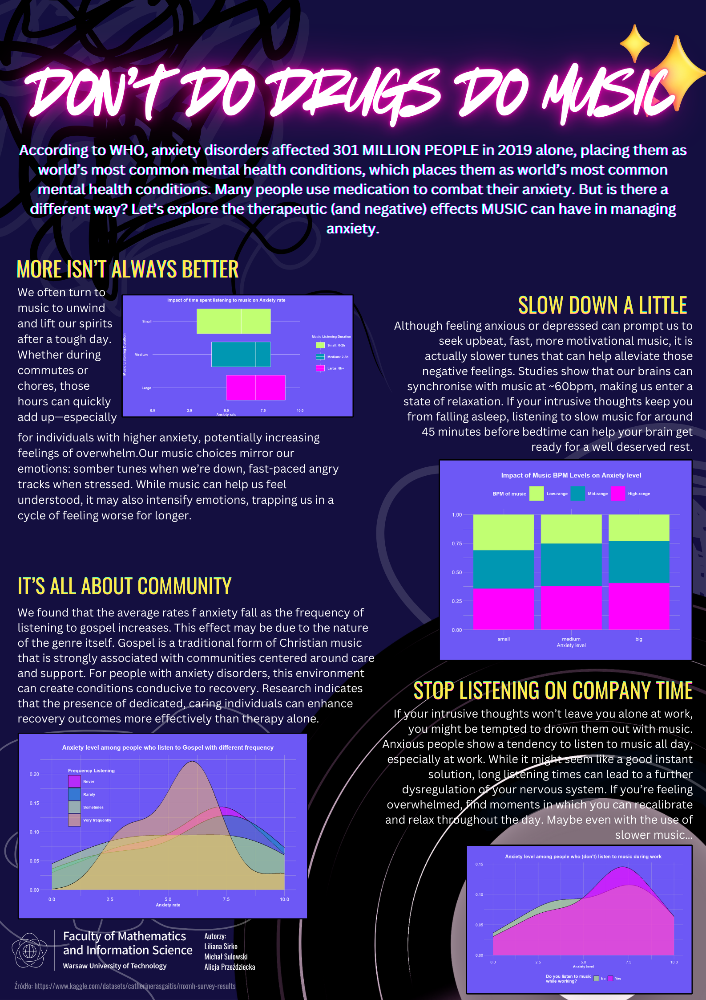

## DON'T DO DRUGS, DO MUSIC

Plakat przedstawia wpływ muzyki na zarządzanie lękiem, podkreślając zarówno pozytywne, jak i negatywne aspekty jej oddziaływania na zdrowie psychiczne. Zawiera dane, które pokazują, że zbyt długie słuchanie muzyki może nasilać uczucie przytłoczenia, szczególnie u osób z wyższym poziomem lęku.

Poruszyliśmy również znaczenie odpowiedniego doboru muzyki – wolniejsze utwory pomagają wyciszyć się i zrelaksować, co może być szczególnie pomocne przed snem. Dodatkowo zwróciliśmy uwagę na pozytywny wpływ muzyki gospel, która sprzyja poczuciu wspólnoty i wsparcia, co może wspomagać proces zdrowienia lepiej niż sama terapia. Ostatecznie, plakat ostrzega przed nadużywaniem muzyki jako mechanizmu unikania trudnych emocji, zwłaszcza w pracy.

Autorzy: Liliana Sirko, Michał Sulowski, Alicja Przeździecka.

Żródło danych:

-   <https://www.kaggle.com/datasets/catherinerasgaitis/mxmh-survey-results?resource=download>

