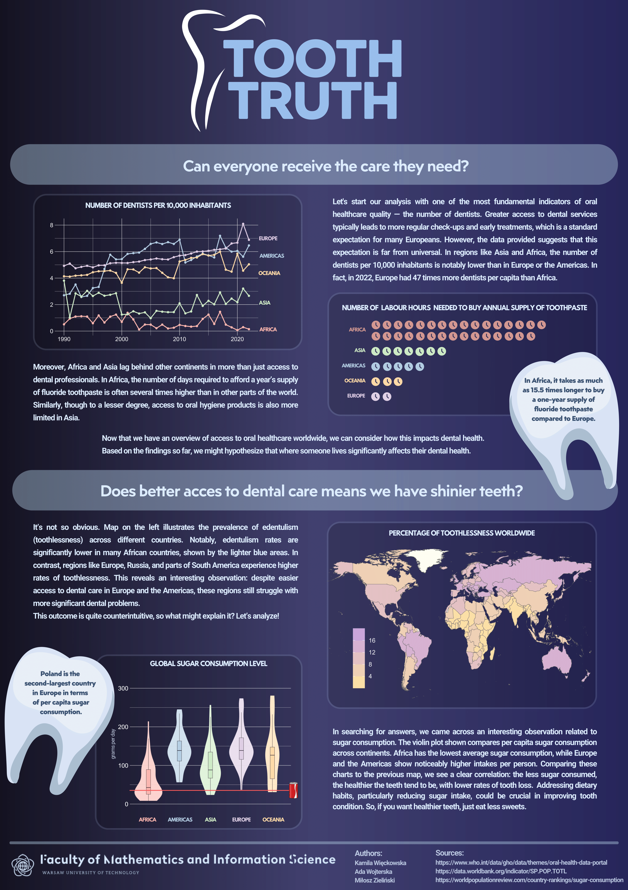

## Tooth Truth

Our poster focuses on oral health. We began our analysis by examining whether people around the world have equal access to resources essential for maintaining good oral hygiene. This involved comparing the number of dentists (per 10,000 people) and the amount of time required to afford a year’s supply of fluoride toothpaste. Next, we analyzed the global distribution of toothlessness to find patterns and differences in oral health between regions. Finally, we explored sugar consumption levels across continents and investigated how they relate to our earlier findings.

Authors: Kamila Więckowska, Ada Wojterska, Miłosz Zieliński.

Sources:
- https://www.who.int/data/gho/data/themes/oral-health-data-portal
- https://data.worldbank.org/indicator/SP.POP.TOTL
- https://worldpopulationreview.com/country-rankings/sugar-consumption

