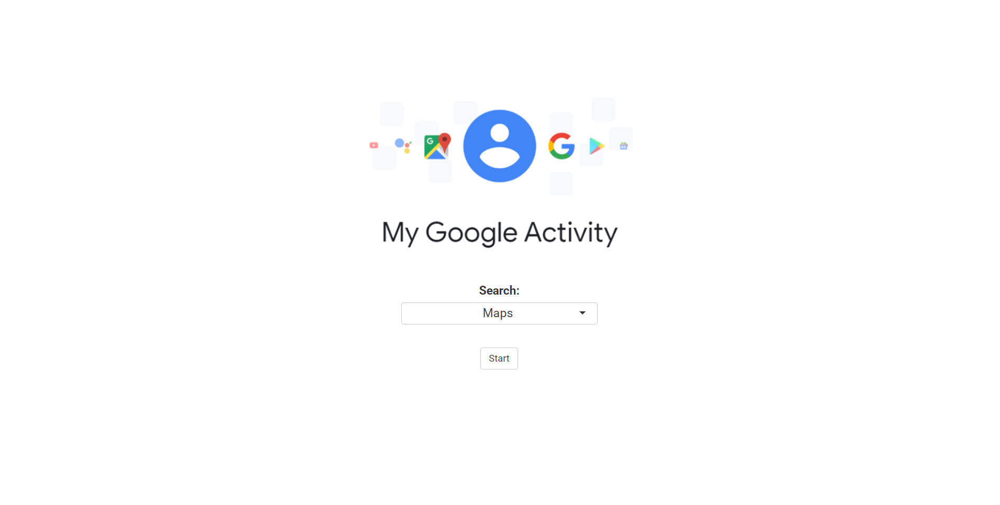
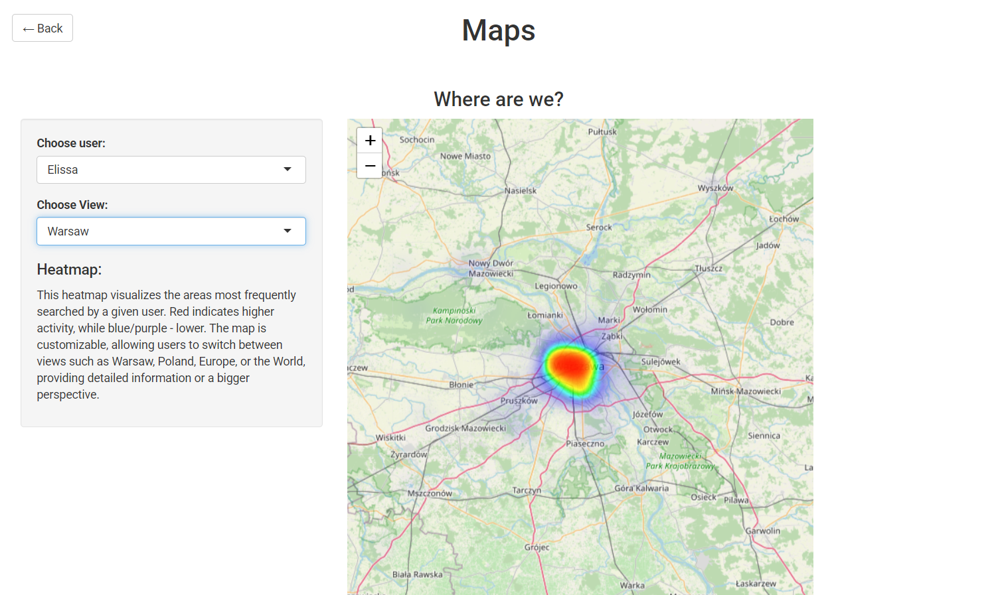
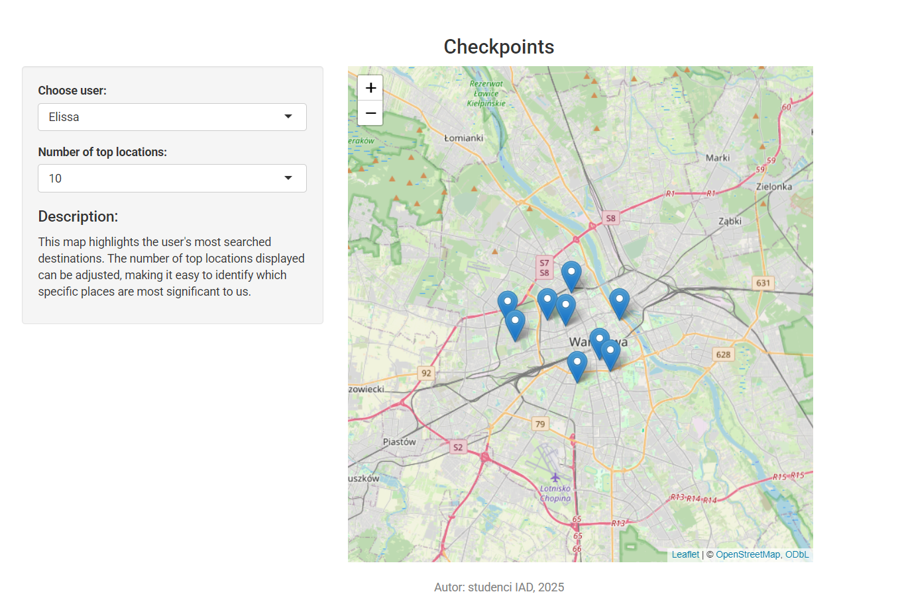
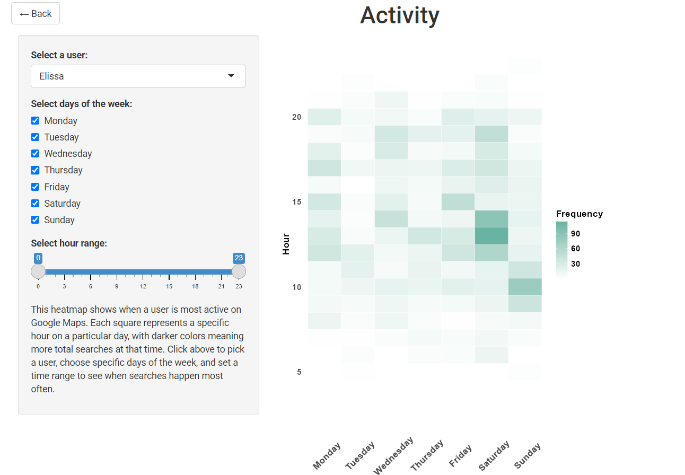
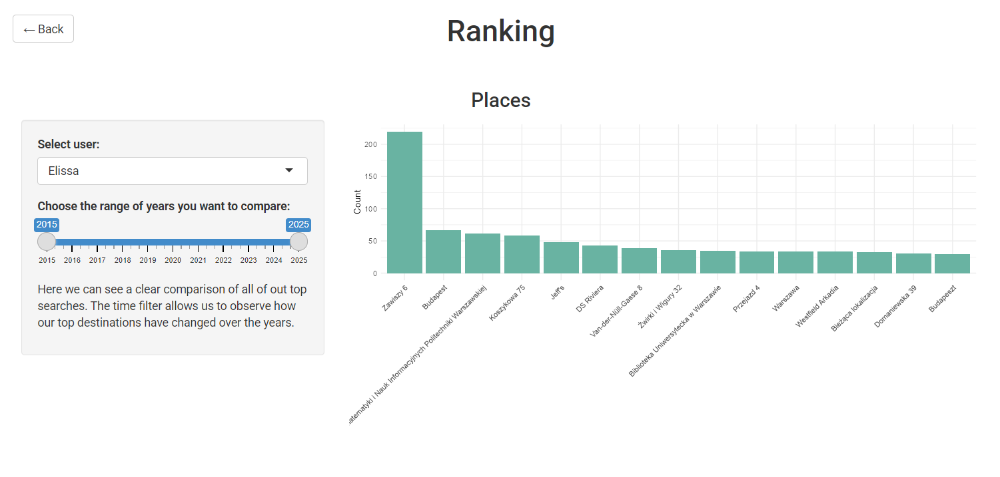
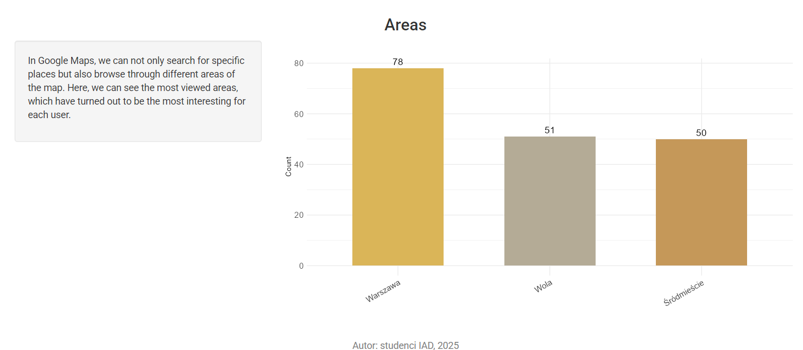
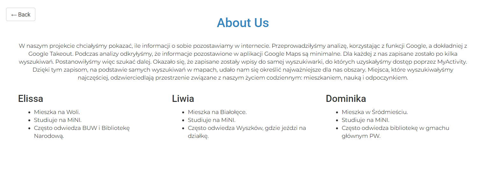

# Projekt JA
Nasz projekt skupia się na wizualizacji danych dostępnych w Google Takeout, w szczególności tych dotyczących Google Maps. Napisana aplikacja umożliwia przedstawianie najczęściej odwiedzanych miejsc czy oglądanych obszarów przy podziale na poszczególne lata. Generuje ona również heatmapę obrazującą miejsca, w których najczęściej przebywamy, jak i informację o intensywności/liczbie wyszukiwań w ciągu dnia czy tygodnia.  
Źródła danych: Google Takeout
# Autorzy: Elissa Hallak, Liwia Jankowska, Daminika Dzeranhouskaya
Wygląd aplikacji:
 

