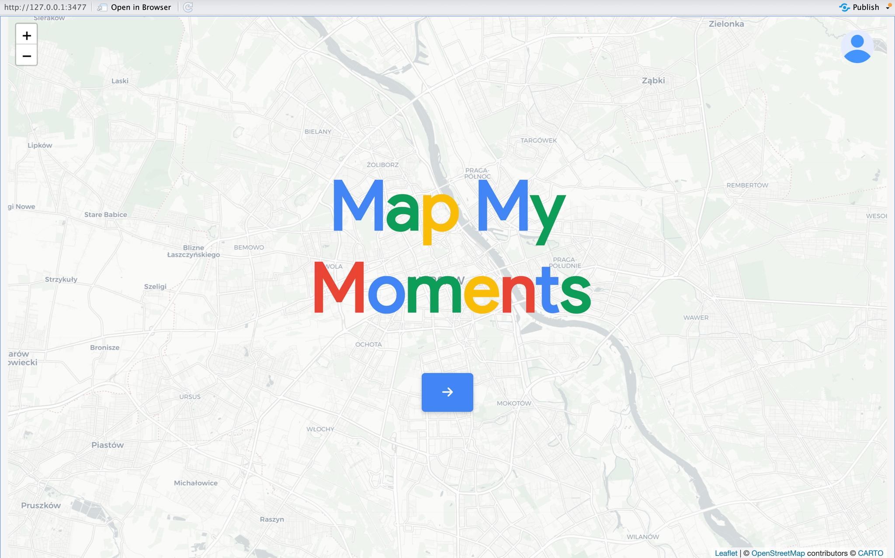
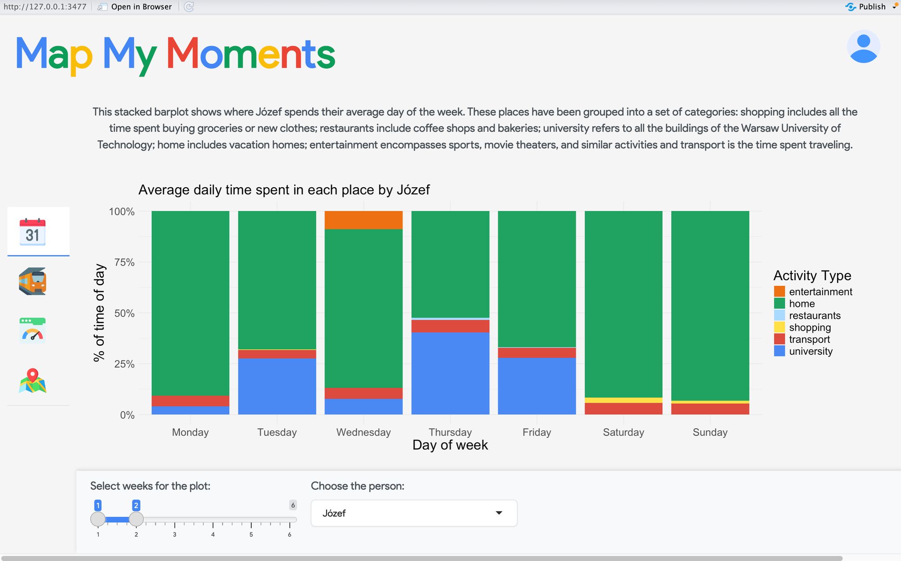
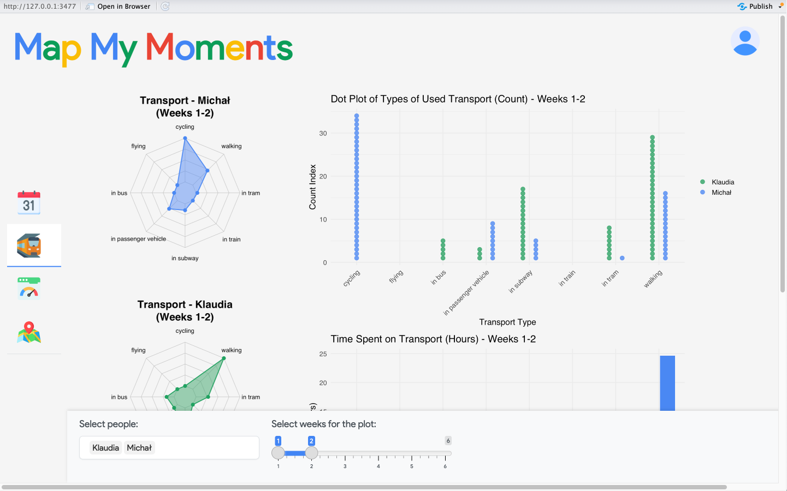
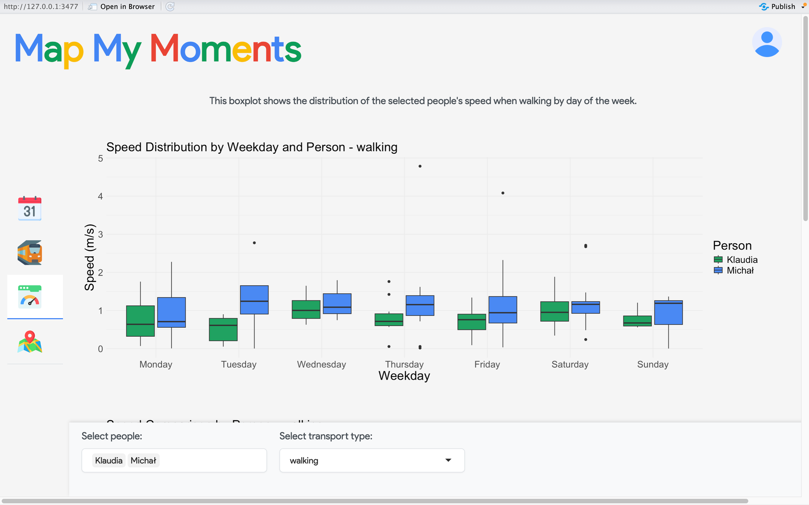
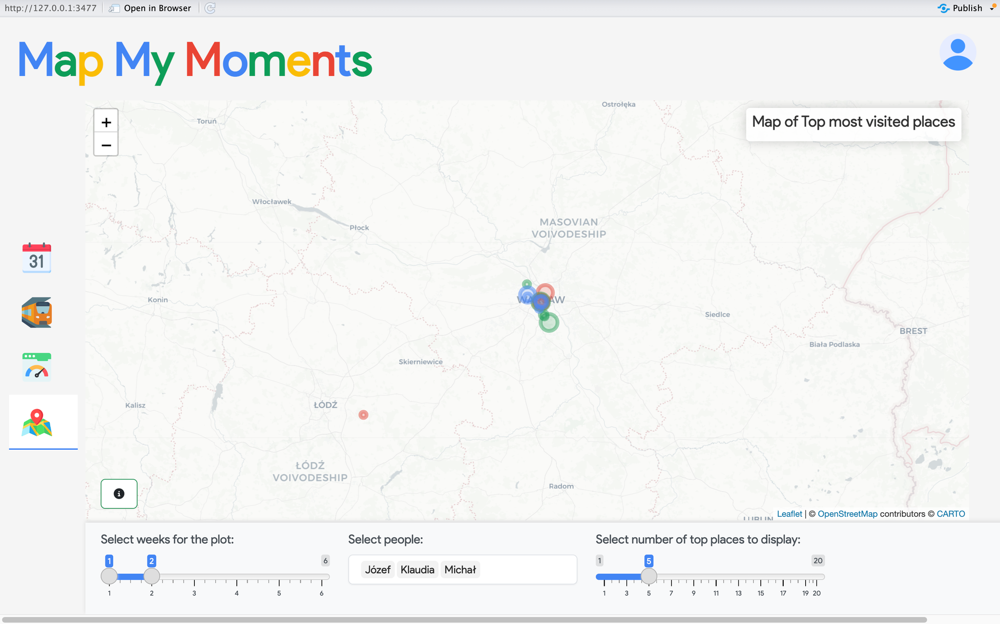

## MapMyMoments

This project data we gathered using google timeline in six weeks from 9/12/2024 to 19/01/2025. We analysed what places we visited and which modes of transport we used. The app is designed to help analyse the results of our data gathering while offering some insight into our daily lives.

Here’s a brief overview of what each page offers:

1.Weekly activities: Here you can see how and where we spend our average day of the week.

2.Transport: This page helps analyse what methods of transport we use.

3.Transport Speed: Here you can find informations on the speed of each method and more.

4.Map: The map displays our most common localisations per week.

Authors: Klaudia Kwoka, Michał Gwóźdź, Józef Dubois
