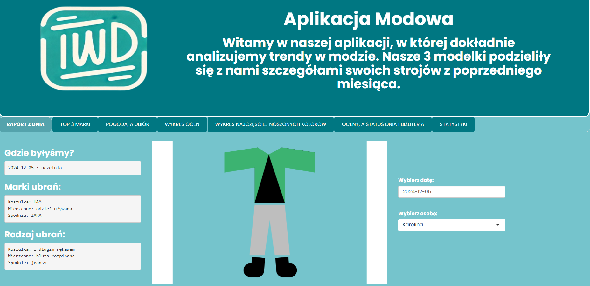
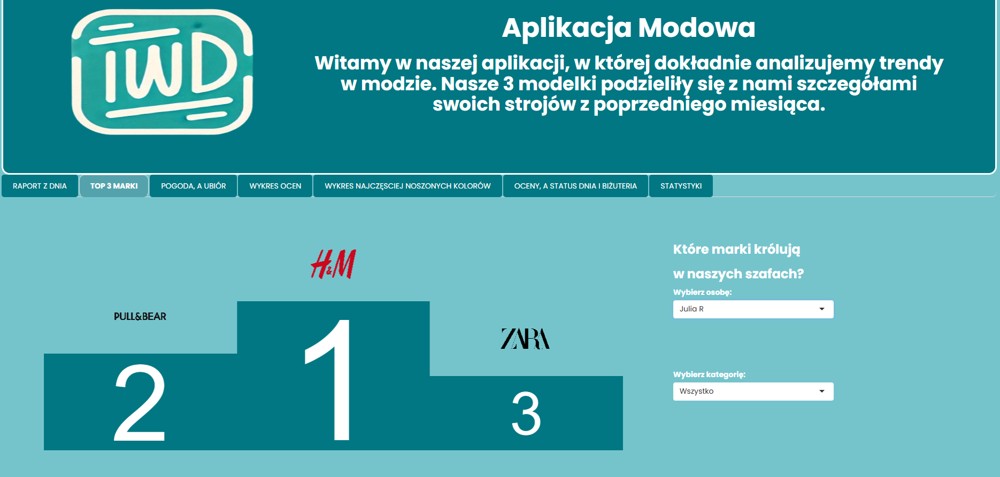
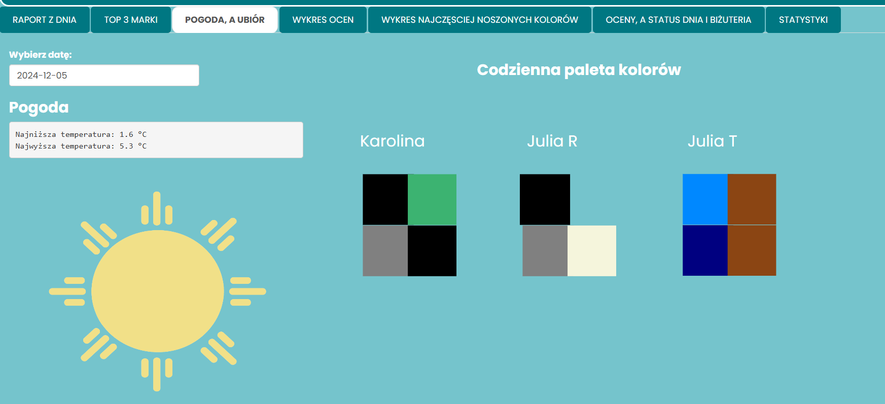
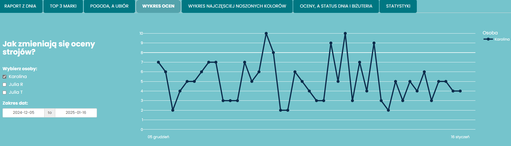
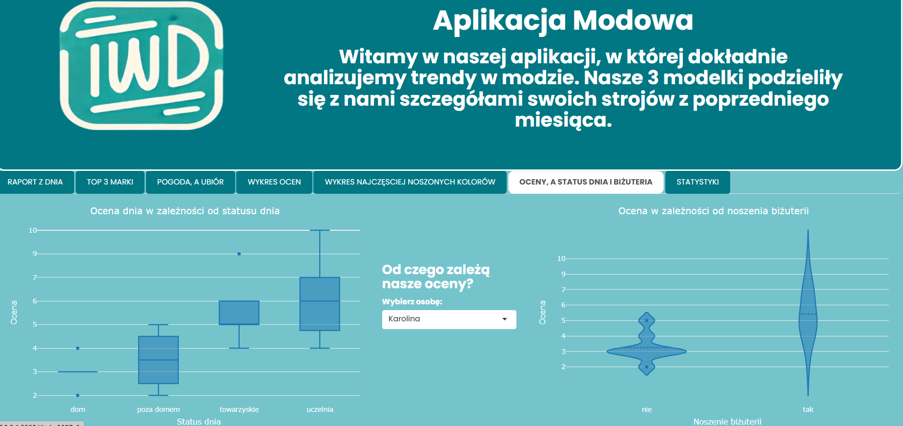
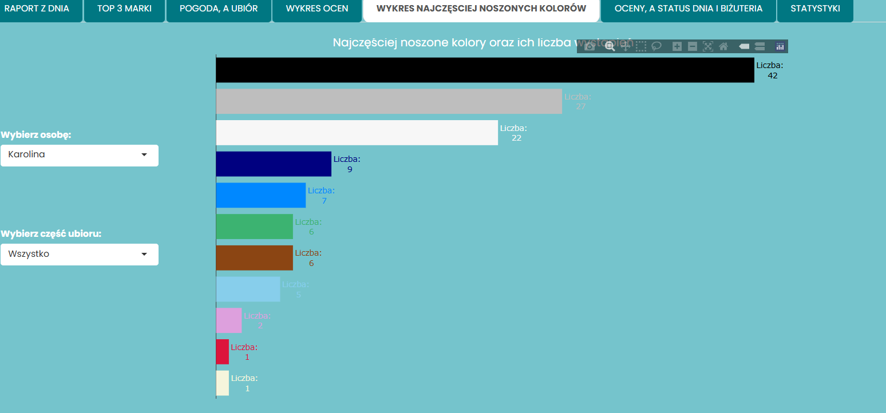
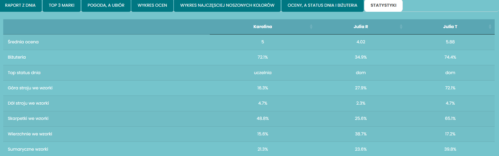

# TWD - Aplikacja Modowa 

Nasz projekt dotyczy danych, które zbierałyśmy od 6.12.2024 do 16.01.2024. Codziennie zapisywałyśmy jaki rodzaj, kolor
oraz markę odzieży miałyśmy na sobie, czy miałyśmy w ten dzień założoną biżuterię oraz jaki status dnia (np. uczelnia, dom)
miałyśmy danego dnia. Dodatkowo subiektywnie również wystawiałyśmy ocenę za nasz strój.
Zaprojektowana przez nas aplikacja oferuje dostęp do najbardziej ciekawych zebranych przez nas zależności.

## Krótki opis aplikacji

Aplikacja posiada wiele stron, które oferują informacje o:

- ubiorze każdej z nas wybranego przez użytkownika dnia,
- najczęsciej noszonych przez nas marek ubrań,
- najczęściej noszonych przez nas kolorów,
- zależności pogody od naszych codziennych strojów,
- zależności wystawianych przez nas ocen za strój.

## Wygląd aplikacji:

Autorzy: Karolina Kawulska, Julia Tomaszkiewicz, Julia Radacka

