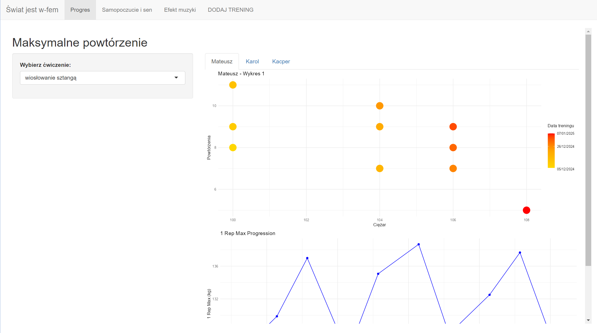

# Aplikacja ukazująca postępy na siłowni #

***

### Opis aplikacji ###

    Nasza aplikacja zajmuje się badaniem naszych postępów na siłowni. Dla każdego treningu zbieraliśmy dane dotyczące jego rodzaju, rodzaju ćwiczeń, jakie wykonywaliśmy, a także informacje o liczbie serii i powtórzeń, a także inne dane, które mogły mieć wpływ na jakość naszego treningu: samopoczucie, ilość snu, rodzaj muzyki słuchanej podczas treningu itp. Za pomocą wykresów ukazaliśmy różne ciekawe zależności.

###W Wygląd aplikacji ###

### Autorzy ###

* Mateusz Stasiak
* Kacper Tomczyk
* Karol Socha