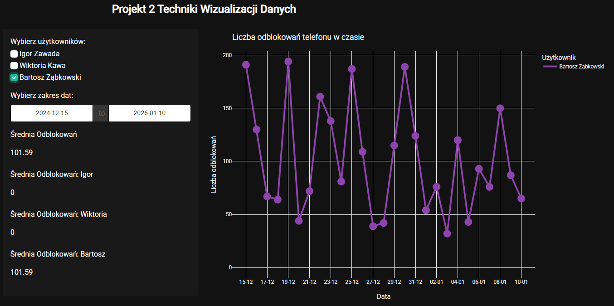
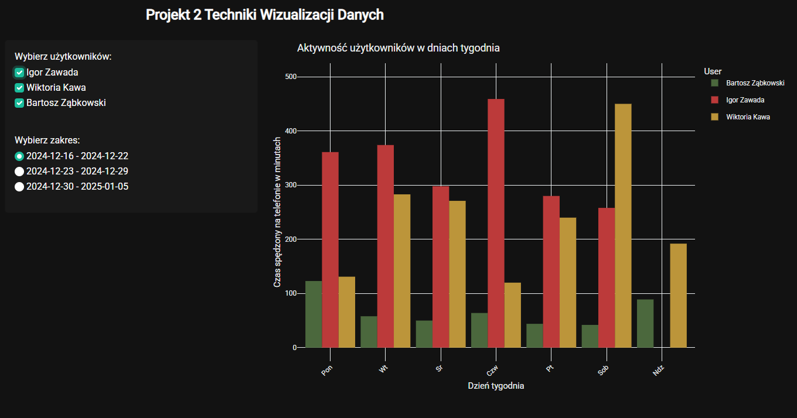

# Projekt: Ja
#### Autorzy: Bartosz Ząbkowski, Wiktoria Kawa, Igor Zawada
W naszym zespole przez około miesiąc skrupulatnie zbieraliśmy dane ile
dziennie spędzamy czasu na aplikacjach mobilnych na naszych telefonach. Nasze dane które
zapisywaliśmy w formacie csv przez około miesiąc zdecydowaliśmy się zaprezentować na trzech interaktywnych wykresach. W dodatku 
w aplikacji zawarliśmy krótką mini grę.

